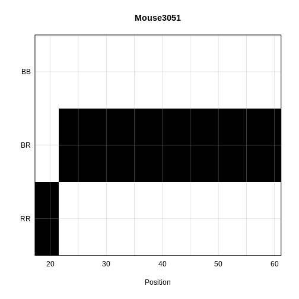

:::::::::::::::::::::::::::::::::::::: questions 

- How do I calculate QTL at positions between genotyped markers?
- How do I calculate QTL genotype probabilities?
- How do I calculate allele probabilities?
- How can I speed up calculations if I have a large data set?

::::::::::::::::::::::::::::::::::::::::::::::::

::::::::::::::::::::::::::::::::::::: objectives

- To explain why the first step in QTL analysis is to calculate genotype 
probabilities.
- To calculate genotype probabilities.

::::::::::::::::::::::::::::::::::::::::::::::::

The first task in QTL analysis is to calculate conditional genotype 
probabilities, given the observed marker data, at each putative QTL position. 
For example, the first step would be to determine the probabilities for 
genotypes BR and RR at the locus indicated below.

{alt="a chromosome with two typed markers labeled BR and RR with a locus of unknown genotype between them"}

The `calc_genoprob()` function calculates QTL genotype probabilities conditional 
on the available marker data. These are needed for most of the QTL mapping 
functions. The result is returned as a list of three-dimensional arrays 
(one per chromosome). Each 3d array of probabilities is arranged as individuals 
$\times$ genotypes $\times$ positions.

{alt='Figure showing three-dimensional array of genotype probabilities (genoprobs)'}

{alt='a web page showing R data structures including one-dimensional vectors and lists, two dimensional dataframes and matrices, and n-dimensional arrays'}
Notice that arrays in R require data to be all of the same type - all numeric,
all character, all Boolean, etc. If you are familiar with data frames in R you
know that you can mix different kinds of data in that structure. The first 
column might contain numeric data, the second column character data, the third
Boolean (True / False), and so on. Arrays won't accept mixed data types though.

We'll use the
[Attie BL6/BTBR dataset](https://thejacksonlaboratory.box.com/shared/static/svw7ivp5hhmd7vb8fy26tc53h7r85wez.zip)
from 
[Tian et al](https://www.ncbi.nlm.nih.gov/pmc/articles/PMC4649649/)
(an intercross) as an example. In this study, circulating insulin levels were 
measured in an F2 cross between mouse strains C57BL/6J and BTBTR T+ <tf>. 

First, we will load in the [qtl2](https://kbroman.org/qtl2/) library, which 
provides the functions that we will use for QTL analysis.


``` r
library(qtl2)
```

The function `read_cross2()` has a single argument: the name (with path) of the 
control file, or alternatively a zip file containing all the required data. We 
read in the data with a JSON control file like this:


``` r
cross <- read_cross2(file = 'data/attie_control.json')
```

:::::::::::::::::::::::::::::::::::::::::::::::::::::::::::: instructor

We need the following block for the site to build on Github. The students do
not need to see or run the next block.

:::::::::::::::::::::::::::::::::::::::::::::::::::::::::::::::::::::::


To load your own data from your machine, you would use the file path to your 
data files. For example, if the file path to your data files is 
`/Users/myUserName/qtlProject/data`, the command to load your data would look 
like this:


``` r
myQTLdata <- read_cross2(file = "/Users/myUserName/qtlProject/data/myqtldata.json" )
```

The JSON file contains all control information for your data, including names of 
data files, cross type, column specifications for sex and cross information, and 
more. This can also be in YAML format. Alternatively, all data files can be 
zipped together for loading.


``` r
myQTLdata <- read_cross2(file = "/Users/myUserName/qtlProject/data/myqtldata.zip" )
```

Back to the BTBR data. Now look at a summary of the cross data and the names of 
each variable within the data.


``` r
summary(cross)
```

``` output
Object of class cross2 (crosstype "f2")

Total individuals             490
No. genotyped individuals     490
No. phenotyped individuals    490
No. with both geno & pheno    490

No. phenotypes                  3
No. covariates                  8
No. phenotype covariates        0

No. chromosomes                20
Total markers                2057

No. markers by chr:
  1   2   3   4   5   6   7   8   9  10  11  12  13  14  15  16  17  18  19   X 
156 135 157 126 125 102 109  91  93 123 124 116 116  91 102  66  60  95  50  20 
```

``` r
names(cross)
```

``` output
 [1] "crosstype"  "geno"       "gmap"       "pmap"       "pheno"     
 [6] "covar"      "is_x_chr"   "is_female"  "cross_info" "alleles"   
```


::::::::::::::::::::::::::::::::::::: challenge 

## Challenge 1

1). How many mice are in this study?  
2). How many phenotypes are there?    
3). How many markers?   
4). How many markers are on chr 11?     

:::::::::::::::::::::::: solution 

The output of `summary(cross)` provides this information.  
1). There are 490 individuals in the cross.  
2). 3 phenotypes    
3). 2,057 markers     
4). 124 markers on chromosome 11 

:::::::::::::::::::::::::::::::::

:::::::::::::::::::::::::::::::::::::


Have a look at the markers listed in the genetic map, `gmap`. Markers are listed 
by chromosome and described by cM position. View only the markers on the first 
two chromosomes.


``` r
head(cross$gmap, n=1)
```

``` output
$`1`
rs13475697  rs3681603 rs13475703 rs13475710  rs6367205 rs13475716 rs13475717 
 0.1881141  0.1920975  0.4167755  0.6488793  0.6555814  0.6638576  0.6676198 
rs13475719 rs13459050  rs3680898 rs13475727 rs13475728 rs13475729 rs13475731 
 0.6711377  0.6749344  0.6775292  1.8149573  1.9596637  2.3456569  2.7186389 
rs13475737 rs13475744  rs6397513 rs13475747 rs13475748 rs13475749 rs13475750 
 3.1059517  3.8222865  4.3094607  4.3120150  4.5098582  4.8154609  4.8853505 
rs13475751 rs13475752 rs13475762 rs13475764 rs13475765 rs13475768 rs13475769 
 4.8869793  4.8902179  7.2954871  8.2102887  8.3708197  8.7178703  8.8859153 
rs13475771  rs6384194 rs13475790  rs3676270 rs13475794 rs13475801  rs4222269 
 9.1374722  9.9295192  9.9970634 10.1508878 10.3962716 11.5981956 11.9606369 
 rs6387241 rs13475822 rs13475824 rs13475826 rs13475827 rs13475834 rs13475880 
16.8770742 16.9815396 17.4434784 18.0866148 18.6276972 19.2288050 27.4056813 
rs13475883  rs6239834  rs3162895  rs6212146  rs3022802 rs13475899 rs13475900 
28.4641674 30.8427150 31.1526514 31.2751278 31.3428706 31.8493556 31.8518088 
rs13475906  rs3022803 rs13475907 rs13475909 rs13475912  rs6209698 rs13475929 
32.2967145 32.3074644 32.3683291 32.8001894 33.6026526 36.5341646 37.6881435 
rs13475931 rs13475933 rs13475934  rs4222476 rs13475939  rs8253473 rs13475941 
37.7429827 38.0416271 38.0430095 38.9647582 39.4116688 39.4192277 39.4871064 
rs13475944 rs13475947 rs13475948 rs13475950 rs13475951 rs13475954 rs13475955 
39.7672829 40.2599440 40.3380113 40.3417592 40.3439501 41.1407252 41.2887176 
rs13475963 rs13475966 rs13475967 rs13475970 rs13475960  rs6250696 rs13475973 
42.4744416 42.5667702 42.9736574 43.1427994 43.5985261 43.5992946 43.6014053 
 rs3691187 rs13475988 rs13475991 rs13476023 rs13476024  rs3684654  rs6274257 
44.6237384 45.7855528 46.0180221 47.8579278 47.8600317 48.2423958 48.9612178 
rs13476045 rs13476049  rs6319405 rs13476050 rs13476051 rs13476054 rs13476057 
49.2018340 49.3701384 49.4261039 49.4275718 49.4323558 49.4972616 49.5031830 
rs13476059 rs13476060 rs13476062 rs13476066 rs13476067  rs6259837 rs13476080 
49.5084008 49.5113545 49.6085043 49.6644819 50.1779477 50.8256056 51.0328603 
 rs6302966 rs13476085 rs13476089  rs3717360 rs13476090  rs6248251 rs13476091 
51.3659553 51.6974451 52.3869798 52.3903517 52.3936241 52.4228715 52.5787388 
 rs3088725  rs3022832  rs4222577 rs13476100  rs6263067  rs8256168  rs6327099 
53.4044231 53.4129004 53.4189013 54.3267003 54.4193890 55.1459517 55.3274320 
rs13476111 rs13476119  rs8236484  rs8270838  rs8236489 rs13476129 rs13476134 
55.9050491 56.8936305 56.9852502 57.1870637 58.0248893 58.7605079 59.5401544 
rs13476135 rs13476137 rs13476138 rs13476140 rs13476148  rs6202860 rs13476158 
59.5426193 59.6023794 60.3355828 60.3439598 61.1791787 61.9905512 61.9930265 
rs13476163 rs13476177 rs13476178 rs13476183 rs13476184  rs6194543 rs13476196 
62.0039607 62.6243588 62.6269118 63.8101331 64.0856907 66.4047817 66.7425394 
rs13476201  rs3685700  rs3022846 rs13476210 rs13476214 rs13459163  rs4222816 
67.2638714 68.7230251 68.7246243 69.1209547 70.1550813 75.5548371 75.5593190 
 rs4222820  rs3090340  rs8245949 rs13476242 rs13476251 rs13476254  rs6383012 
75.5593202 75.5637846 76.7508053 79.0157673 79.7644000 79.8248805 85.3173344 
rs13476279  rs6348421 rs13476290 rs13476300 rs13476302 rs13476304  rs3669814 
86.7653503 88.2128991 89.0565541 94.6215368 94.8227821 94.8269227 95.5413280 
rs13501301 rs13476316 
96.0784002 96.9960494 
```

Next we use `calc_genoprob()` to calculate the QTL genotype probabilities.


``` r
probs <- calc_genoprob(cross      = cross, 
                       map        = cross$gmap, 
                       error_prob = 0.002)
```

The argument `error_prob` supplies an assumed genotyping error probability of 
0.002. If a value for `error_prob` is not supplied, the default probability is 
0.0001. 

Recall that the result of `calc_genoprob`, `probs`, is a list of 
three-dimensional arrays (one per chromosome). 


``` r
names(probs)
```

``` output
 [1] "1"  "2"  "3"  "4"  "5"  "6"  "7"  "8"  "9"  "10" "11" "12" "13" "14" "15"
[16] "16" "17" "18" "19" "X" 
```

Each three-dimensional array of probabilities is arranged as individuals 
$\times$ genotypes $\times$ positions. Have a look at the names of each of the 
three dimensions for chromosome 19.


``` r
head(dimnames(probs$`19`)[[1]])
```

``` output
[1] "Mouse3051" "Mouse3551" "Mouse3430" "Mouse3476" "Mouse3414" "Mouse3145"
```


``` r
dimnames(probs$`19`)[2]
```

``` output
[[1]]
[1] "BB" "BR" "RR"
```


``` r
dimnames(probs$`19`)[3]
```

``` output
[[1]]
 [1] "rs4232073"  "rs13483548" "rs13483549" "rs13483550" "rs13483554"
 [6] "rs13483555" "rs3090321"  "rs3090137"  "rs6309315"  "rs13483577"
[11] "rs3090325"  "rs13483579" "rs13483584" "rs13483586" "rs13483587"
[16] "rs13483589" "rs13483592" "rs13483593" "rs6344448"  "rs13483594"
[21] "rs13483595" "rs3705022"  "rs13483609" "rs13483612" "rs13483648"
[26] "rs13483650" "rs13483654" "rs13483658" "rs13483660" "rs13483664"
[31] "rs13483666" "rs13483667" "rs13483670" "rs8275553"  "rs8275912" 
[36] "rs13483677" "rs13483679" "rs13483680" "rs13483681" "rs3660143" 
[41] "rs13483682" "rs13483683" "rs13483685" "rs13483686" "rs6355398" 
[46] "rs4222106"  "rs13483690" "rs13483693" "rs13483695" "rs13483699"
```

View the first three rows of genotype probabilities for the first genotyped 
marker on chromosome 19.


``` r
(probs$`19`)[1:5, , "rs4232073"]
```

``` output
                    BB           BR           RR
Mouse3051 1.317728e-11 1.235895e-07 9.999999e-01
Mouse3551 9.999840e-01 1.595361e-05 5.027172e-08
Mouse3430 1.317728e-11 1.235895e-07 9.999999e-01
Mouse3476 9.999999e-01 1.235895e-07 1.317728e-11
Mouse3414 6.179474e-08 9.999999e-01 6.179474e-08
```

We can also view the genotype probabilities using 
[plot_genoprob](https://github.com/rqtl/qtl2/blob/master/R/plot_genoprob.R). The 
arguments to this function specify:

1. `probs`: the genotype probabilities,
1. `map`: the marker map,
1. `ind`: the index of the individual to plot,
1. `chr`: the index of the chromosome to plot.


``` r
plot_genoprob(probs = probs, 
              map   = cross$pmap, 
              ind   = 1, 
              chr   = 19, 
              main  = rownames(probs[['19']])[1])
```



The coordinates along chromosome 19 are shown on the horizontal axis and the 
three genotypes are shown on the vertical axis. Higher genotype probabilities 
are plotted in darker shades. This mouse has a RR genotype on the proximal end 
of the chromosome and transitions to BR.

::::::::::::::::::::::::::::::::::::: challenge 

## Challenge 2

1). Load a second dataset from the 
[qtl2data repository](https://github.com/rqtl/qtl2data). Locate the
[BXD directory](https://github.com/rqtl/qtl2data/tree/main/BXD) and load the
data directly from the web using this code given at the bottom of the 
`ReadMe.md` file.  

`file <- paste0("https://raw.githubusercontent.com/rqtl/", "qtl2data/main/BXD/bxd.zip")`. 

`bxd <- read_cross2(file)`  

2). How many individuals were in the study? How many phenotypes? 
How many markers?  
  
3). Calculate genotype probabilities and save the results to an object 
called `bxdpr`. View the genotypes for the first three markers on chromosome 1 
for the first five individuals.   

:::::::::::::::::::::::: solution 

1). `file <- paste0("https://raw.githubusercontent.com/rqtl/", "qtl2data/main/BXD/bxd.zip")`.      
`bxd <- read_cross2(file)`    
2). `summary(bxd)` gives 198 individuals, 5,806 phenotypes and 7,320 markers.     
3). `bxdpr  <- calc_genoprob(cross = bxd, map = bxd$gmap)` followed by  
`(bxdpr$`1`)[1:5, , 1:3]`

:::::::::::::::::::::::::::::::::


## Challenge 3

Plot the genotype probabilities for individual number 3 for chromosome 1.

:::::::::::::::::::::::: solution 

`plot_genoprob(probs = bxdpr,  
               map   = bxd$pmap,   
               ind   = 3,  
               chr   = 1,  
               main  = rownames(bxdpr[['1']])[3])`

:::::::::::::::::::::::::::::::::


:::::::::::::::::::::::::::::::::::::


**Parallel calculations (optional)** To speed up the calculations with large 
datasets on a multi-core machine, you can use the argument `cores`. With 
`cores=0`, the number of available cores will be detected via 
`parallel::detectCores()`. Otherwise, specify the number of cores as a positive 
integer.


``` r
probs <- calc_genoprob(cross = iron, 
                         map = map, 
                  error_prob = 0.002, 
                       cores = 4)
```

**Allele probabilities (optional)** The genome scan functions use genotype 
probabilities as well as a matrix of phenotypes. If you wished to perform a 
genome scan via an additive allele model, you would first convert the genotype 
probabilities to allele probabilities, using the function 
`genoprob_to_alleleprob()`.


``` r
apr <- genoprob_to_alleleprob(probs = probs)
```

::::::::::::::::::::::::::::::::::::: keypoints 

- The first step in QTL analysis is to calculate genotype probabilities.
- Calculate genotype probabilities between genotyped markers with 
`calc_genoprob()`.

::::::::::::::::::::::::::::::::::::::::::::::::
