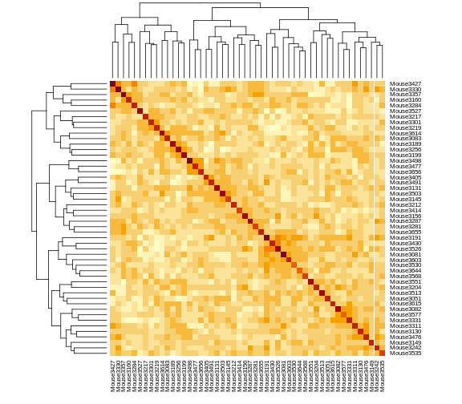

:::::::::::::::::::::::::::::::::::::: questions 

- Why would I calculate kinship between individuals?
- How do I calculate kinship between individuals?
- What does a kinship matrix look like?

::::::::::::::::::::::::::::::::::::::::::::::::

::::::::::::::::::::::::::::::::::::: objectives

- Explain why and when kinship calculation matters in mapping.
- Create a kinship matrix for individuals.

::::::::::::::::::::::::::::::::::::::::::::::::


Population structure and kinship are common confounding factors in genome-wide 
association studies (GWAS), case-control studies, and other study types in 
genetics. They create false positive associations between genotype and phenotype 
at genetic markers that differ in genotype frequencies between subpopulations 
due to genetic relatedness between samples. Simple association tests assume 
statistical independence between individuals. Population structure and kinship 
confound associations when phenotype covariance between individuals results from 
genetic similarity. Accounting for relatedness between individuals helps to 
distinguish true associations from false positives generated by population 
structure or kinship. 

As an example see the table below for phenotype and genotype frequencies between 
two subpopulations in a case-control study.


|                              |subpop1|subpop2|overall pop
|:-----------------------------|:-----:|:-----:|:-----:|
| frequency                    |  0.5  |  0.5  |   1   |
| probability of AA genotype   |  0.1  |  0.9  |  0.5  |
| probability of disease       |  0.9  |  0.1  |  0.5  |
| probability of disease & AA  |  0.09 |  0.09 |  0.09 |

The full population consists of two equally represented subpopulations. In the 
overall population, the probability of the AA genotype is 0.5, and the 
probability of disease is also 0.5. The joint probability of both disease and AA 
genotype in the population (0.09) is less than either the probability of disease 
(0.5) or the probability of the AA genotype (0.5) alone, and is considerably 
less than the joint probability of 0.25 that would be calculated if 
subpopulations weren't taken into account. In a case-control study that fails to 
recognize subpopulations, most of the cases will come from subpopulation 1 since 
this subpopulation has a disease probability of 0.9. However, this subpopulation 
also has a low probability of the AA genotype. So a false association between AA 
genotype and disease would occur because only overall population probabilities 
would be considered.

## Kinship Calculation

In the B6/BTBR cross, we have three possible genotypes: BB, BR, and RR. Suppose
that we look at the genotypes of two mice and estimate their kinship. To do 
this, we select the first allele from mouse 1 and get the probability of 
picking the same allele from mouse 2. Then we do the same procedure with the 
second allele and take the mean. This calculates the mean allele-sharing at
that marker. We do this for all markers and take the overall mean.

Let's look at an exmaple. In the table below, we have listed four markers and
their genotypes in mouse 1 (M1) and mouse 2 (M2). At each marker, we applied
the procedure above and recorded the allele-sharing. Then we took the mean and
found that these two mice have a kinship value of 0.5.

 marker | M1 | M2 | allele-sharing
--------+----+----+---------------
    1   | BB | BB |  1.0
    2   | BB | BR |  0.5
    3   | BB | RR |  0.0
    4   | BR | BR |  0.5
   ---  | -- | -- |  ---
   All  | -- | -- |  0.5

::::::::::::::::::::::::::::::::::::: challenge 

## Challenge 1: Calculate the kinship of the following two set of mice.

1.  

 marker | M1 | M2 
--------+----+----
    1   | BB | RR 
    2   | BB | RR 
    3   | BB | RR 
    4   | BB | BR 

2.  

 marker | M1 | M2 
--------+----+----
    1   | BB | BR 
    2   | BB | BR 
    3   | RR | RR 
    4   | RR | RR 


:::::::::::::::::::::::: solution 

1.  

 marker | M1 | M2 | allele-sharing
--------+----+----+----------------
    1   | BB | RR |  0.0
    2   | BB | RR |  0.0
    3   | BB | RR |  0.0
    4   | BB | BR |  0.5
   ---  | -- | -- |  ---
   All  | -- | -- |  0.1
   
2.  

 marker | M1 | M2 | allele-sharing
--------+----+----+---------------
    1   | BB | BR | 0.5
    2   | BB | BR | 0.5
    3   | RR | RR | 1.0
    4   | RR | RR | 1.0
   ---  | -- | -- | ---
   All  | -- | -- | 0.75 

:::::::::::::::::::::::::::::::::
:::::::::::::::::::::::::::::::::::::::::::::::

Linear mixed models (LMMs) consider genome-wide similarity between all pairs of 
individuals to account for population structure, known kinship and unknown 
relatedness. They model the covariance between individuals. Linear mixed models 
in association mapping studies can successfully correct for genetic relatedness 
between individuals in a population by incorporating kinship into the model. To 
perform a genome scan by a linear mixed model, accounting for the relationships 
among individuals (in other words, including a random polygenic effect), you'll 
need to calculate a kinship matrix for the individuals. This is accomplished 
with the `calc_kinship()` function. It takes the genotype probabilities as 
input.


``` r
kinship <- calc_kinship(probs = probs)
```

Take a look at the kinship values calculated for the first 5 individuals.


``` r
kinship[1:5, 1:5]
```

``` output
          Mouse3051 Mouse3551 Mouse3430 Mouse3476 Mouse3414
Mouse3051     0.737     0.501     0.535     0.520     0.510
Mouse3551     0.501     0.758     0.515     0.512     0.499
Mouse3430     0.535     0.515     0.749     0.458     0.493
Mouse3476     0.520     0.512     0.458     0.749     0.434
Mouse3414     0.510     0.499     0.493     0.434     0.696
```

We can also look at the first 50 mice in the kinship matrix.


``` r
n_samples <- 50
heatmap(kinship[1:n_samples, 1:n_samples], symm = TRUE)
```



The mice are listed in the same order on both sides of the matrix. The comb-like 
structures are called "dendrograms" and they indicate how the mice are clustered 
together. Each cell represents the degree of allele sharing between mice. Red 
colors indicate higher kinship and yellow colors indicate lower kinship. Each 
mouse is closely related to itself, so the cells along the diagonal tend to be 
darker than the other cells. You can see some evidence of related mice, possibly 
siblings, in the orange-shaded blocks along the diagonal.

By default, the genotype probabilities are converted to allele probabilities, 
and the kinship matrix is calculated as the proportion of shared alleles. To use 
genotype probabilities instead, use `use_allele_probs=FALSE` in the call to 
`calc_kinship()`. Further, by default we omit the X chromosome and only use the 
autosomes. To include the X chromosome, use `omit_x=FALSE`.

On a multi-core machine, you can get some speed-up via the `cores` argument, as 
with `calc_genoprob()`.


``` r
kinship <- calc_kinship(probs = probs, 
                        cores = 4)
```

::::::::::::::::::::::::::::::::::::: challenge 

## Challenge 2: What is a Kinship Matrix?

Think about what a kinship matrix is and what it represents. Share your 
understanding with a neighbor. Write your explanation in the collaborative 
document or in your own personal notes.

:::::::::::::::::::::::: solution 

:::::::::::::::::::::::::::::::::

## Challenge 3: Mean Value in Kinship Matrix

What is the mean kinship value of all mice? Can you explain why the value is
the number that you get? Think about the three possible genotypes in the cross
and how they compare to each other.

:::::::::::::::::::::::: solution 


``` r
mean(kinship)
```

``` output
[1] 0.501
```

The mean kinship between the mice in the cross is 0.5. All of the mice were 
derived from F1 parents created from two inbred strains. The kinship calculation
compares the number of identical alleles between mice at each marker. On 
average, each mouse carries 50% B alleles and 50% R alleles. So the mean allele
sharing is 0.5.

:::::::::::::::::::::::::::::::::

## Challenge 4: Kinship of a Mouse with Itself

Look at the values in the kinship matrix. What is the kinship values of each
mouse with itself? Why isn't this equal to 1?

:::::::::::::::::::::::: solution 

The kinship of a mouse with itself will only be 1 if the mouse is homozygous
at every marker. Since the mice in this study are F2s, they will have genomes
that are around 50% heterozygous. The variation in heterozygosity affects
the actual kinship values, but, on average, we expect self-kinship to be 0.75
because half of the genome is homozygous and contributes values of 1, and half
of the genome is heterozygous and contributes values of 0.5. So 
$0.5 * 1 + 0.5 * 0.5 = 0.75$. 

This is shown in the plot below of homozygosity versus kinship. There is a 
clear linear relationship between the two values and at 0.5 homozygosity, the
self-kinship values is 0.75. The slope of the line is 0.5.


``` r
# 1 & 3 are the encoding for the two homozygous genotypes.
homo <- sapply(cross$geno, 
               function(z) {
                 rowSums(z == 1 | z == 3)
               })

homo <- rowSums(homo) / sum(n_mar(cross))

df   <- data.frame(id      = rownames(cross$geno[[1]]),
                   homo    = homo,
                   kinship = diag(kinship))

df |>
  ggplot(aes(homo, kinship)) +
    geom_point(size = 2) +
    labs(title = "Homozygosity versus Self-Kinship",
         x     = "Homozygosity",
         y     = "Self-Kinship") +
    theme(text = element_text(size = 20))
```


``` r
rm(homo, df)
```

:::::::::::::::::::::::::::::::::
::::::::::::::::::::::::::::::::::::::::::::::::


::::::::::::::::::::::::::::::::::::: keypoints 

- Kinship matrices account for relationships among individuals.
- Kinship is calculated as the proportion of shared alleles between 
individuals.
- Kinship calculation is a precursor to a genome scan via a linear mixed 
model.

::::::::::::::::::::::::::::::::::::::::::::::::

