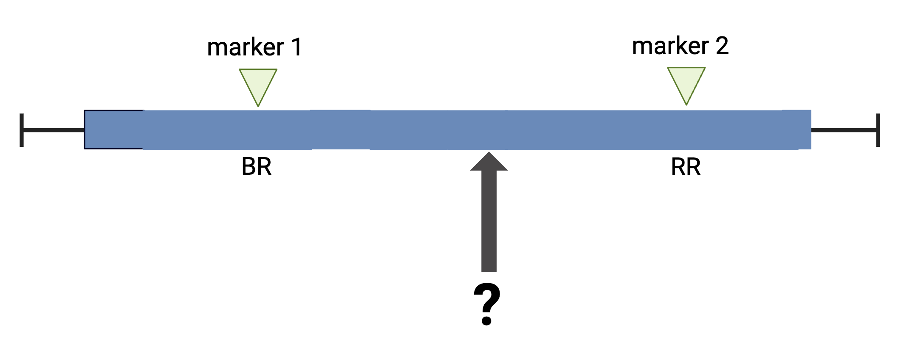
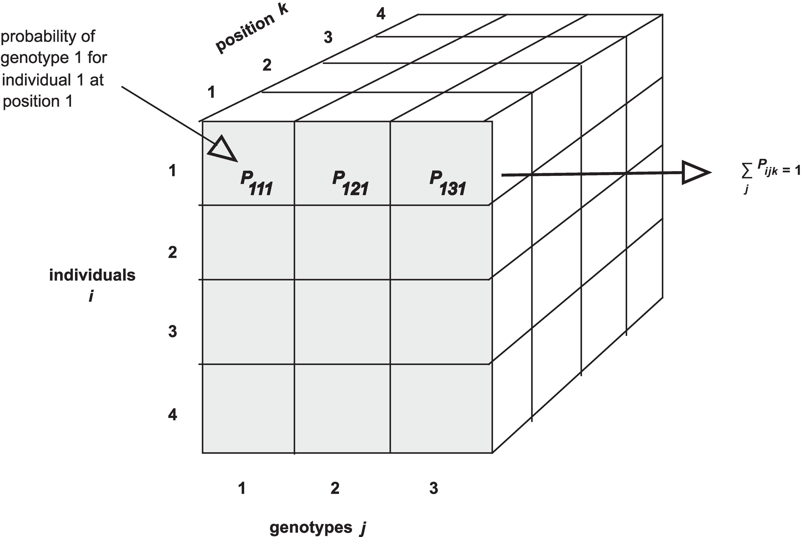

:::::::::::::::::::::::::::::::::::::: questions 

- How do I calculate QTL at positions between genotyped markers?
- How do I calculate QTL genotype probabilities?
- How do I calculate allele probabilities?
- How can I speed up calculations if I have a large data set?

::::::::::::::::::::::::::::::::::::::::::::::::

::::::::::::::::::::::::::::::::::::: objectives

- To explain why the first step in QTL analysis is to calculate genotype 
probabilities.
- To calculate genotype probabilities.

::::::::::::::::::::::::::::::::::::::::::::::::

The first task in QTL analysis is to calculate conditional genotype 
probabilities, given the observed marker data, at each putative QTL position. 
For example, the first step would be to determine the probabilities for 
genotypes BR and RR at the locus indicated below.

{alt="a chromosome with two typed markers labeled BR and RR with a locus of unknown genotype between them"}

The `calc_genoprob()` function calculates QTL genotype probabilities conditional 
on the available marker data. These are needed for most of the QTL mapping 
functions. The result is returned as a list of three-dimensional arrays 
(one per chromosome). Each 3d array of probabilities is arranged as individuals 
$\times$ genotypes $\times$ positions.

{alt='Figure showing three-dimensional array of genotype probabilities (genoprobs)'}

{alt='a web page showing R data structures including one-dimensional vectors and lists, two dimensional dataframes and matrices, and n-dimensional arrays'}.  

We'll use the
[Attie BL6/BTBR dataset](https://thejacksonlaboratory.box.com/shared/static/svw7ivp5hhmd7vb8fy26tc53h7r85wez.zip)
from 
[Tian et al](https://www.ncbi.nlm.nih.gov/pmc/articles/PMC4649649/)
(an intercross) as an example. In this study, circulating insulin levels were 
measured in an F2 cross between mouse strains C57BL/6J and BTBTR T+ <tf>. 

First, we will load in the [qtl2](https://kbroman.org/qtl2/) library, which 
provides the functions that we will use for QTL analysis.

```{r load_libraries}
library(qtl2)
```

The function `read_cross2()` has a single argument: the name (with path) of the 
control file, or alternatively a zip file containing all the required data. We 
read in the data with a JSON control file like this:

```{r load_data, eval=FALSE}
cross <- read_cross2(file = 'data/attie_b6btbr_grcm39/attie_control.json')
```

:::::::::::::::::::::::::::::::::::::::::::::::::::::::::::: instructor

We need the following block for the site to build on Github. The students do
not need to see or run the next block.

:::::::::::::::::::::::::::::::::::::::::::::::::::::::::::::::::::::::

```{r github_load_data, echo=FALSE, warning=FALSE, message=FALSE}
cross <- read_cross2(file = 'https://thejacksonlaboratory.box.com/shared/static/svw7ivp5hhmd7vb8fy26tc53h7r85wez.zip')
```

To load your own data from your machine, you would use the file path to your 
data files. For example, if the file path to your data files is 
`/Users/myUserName/qtlProject/data`, the command to load your data would look 
like this:

```{r load_my_data, eval=FALSE, error=FALSE}
myQTLdata <- read_cross2(file = "/Users/myUserName/qtlProject/data/myqtldata.json" )
```

The JSON file contains all control information for your data, including names of 
data files, cross type, column specifications for sex and cross information, and 
more. This can also be in YAML format. Alternatively, all data files can be 
zipped together for loading.

```{r load_my_zipdata, eval=FALSE, error=FALSE}
myQTLdata <- read_cross2(file = "/Users/myUserName/qtlProject/data/myqtldata.zip" )
```

Back to the BTBR data. Now look at a summary of the cross data and the names of 
each variable within the data.

```{r summary_data}
summary(cross)
names(cross)
```


::::::::::::::::::::::::::::::::::::: challenge 

## Challenge 1

1). How many mice are in this study?  
2). How many phenotypes are there?    
3). How many markers?   
4). How many markers are on chr 11?     

:::::::::::::::::::::::: solution 

The output of `summary(cross)` provides this information.  
1). There are 490 individuals in the cross.  
2). 3 phenotypes    
3). 2,057 markers     
4). 124 markers on chromosome 11 

:::::::::::::::::::::::::::::::::

:::::::::::::::::::::::::::::::::::::


Have a look at the markers listed in the genetic map, `gmap`. Markers are listed 
by chromosome and described by cM position. View only the markers on the first 
two chromosomes.

```{r map_data}
head(cross$gmap, n=1)
```

Next we use `calc_genoprob()` to calculate the QTL genotype probabilities.

```{r calc_genoprob}
probs <- calc_genoprob(cross      = cross, 
                       map        = cross$gmap, 
                       error_prob = 0.002)
```

The argument `error_prob` supplies an assumed genotyping error probability of 
0.002. If a value for `error_prob` is not supplied, the default probability is 
0.0001. 

Recall that the result of `calc_genoprob`, `probs`, is a list of 
three-dimensional arrays (one per chromosome). 

```{r list_chrs}
names(probs)
```

Each three-dimensional array of probabilities is arranged as individuals 
$\times$ genotypes $\times$ positions. Have a look at the names of each of the 
three dimensions for chromosome 19.

```{r view_array1}
head(dimnames(probs$`19`)[[1]])
```

```{r view_array2}
dimnames(probs$`19`)[2]
```

```{r view_array3}
dimnames(probs$`19`)[3]
```

View the first three rows of genotype probabilities for the first genotyped 
marker on chromosome 19.

```{r view_genoprob}
(probs$`19`)[1:5, , "rs4232073"]
```

We can also view the genotype probabilities using 
[plot_genoprob](https://github.com/rqtl/qtl2/blob/master/R/plot_genoprob.R). The 
arguments to this function specify:

1. `probs`: the genotype probabilities,
1. `map`: the marker map,
1. `ind`: the index of the individual to plot,
1. `chr`: the index of the chromosome to plot.

```{r plot_genoprob} 
plot_genoprob(probs = probs, 
              map   = cross$pmap, 
              ind   = 1, 
              chr   = 19, 
              main  = rownames(probs[['19']])[1])
```

The coordinates along chromosome 19 are shown on the horizontal axis and the 
three genotypes are shown on the vertical axis. Higher genotype probabilities 
are plotted in darker shades. This mouse has a RR genotype on the proximal end 
of the chromosome and transitions to BR.

::::::::::::::::::::::::::::::::::::: challenge 

## Challenge 2

1). Load a second dataset from the 
[qtl2data repository](https://github.com/rqtl/qtl2data). Locate the
[BXD directory](https://github.com/rqtl/qtl2data/tree/main/BXD) and load the
data directly from the web using this code given at the bottom of the 
`ReadMe.md` file.  

`file <- paste0("https://raw.githubusercontent.com/rqtl/", "qtl2data/main/BXD/bxd.zip")`. 

`bxd <- read_cross2(file)`  

2). How many individuals were in the study? How many phenotypes? 
How many markers?  
  
3). Calculate genotype probabilities and save the results to an object 
called `bxdpr`. View the genotypes for the first three markers on chromosome 1 
for the first five individuals.   

:::::::::::::::::::::::: solution 

1). `file <- paste0("https://raw.githubusercontent.com/rqtl/", "qtl2data/main/BXD/bxd.zip")`.      
`bxd <- read_cross2(file)`    
2). `summary(bxd)` gives 198 individuals, 5,806 phenotypes and 7,320 markers.     
3). `bxdpr  <- calc_genoprob(cross = bxd, map = bxd$gmap)` followed by  
`(bxdpr$`1`)[1:5, , 1:3]`

:::::::::::::::::::::::::::::::::


## Challenge 3

Plot the genotype probabilities for individual number 3 for chromosome 1.

:::::::::::::::::::::::: solution 

`plot_genoprob(probs = bxdpr,  
               map   = bxd$pmap,   
               ind   = 3,  
               chr   = 1,  
               main  = rownames(bxdpr[['1']])[3])`

:::::::::::::::::::::::::::::::::


:::::::::::::::::::::::::::::::::::::


**Parallel calculations (optional)** To speed up the calculations with large 
datasets on a multi-core machine, you can use the argument `cores`. With 
`cores=0`, the number of available cores will be detected via 
`parallel::detectCores()`. Otherwise, specify the number of cores as a positive 
integer.

```{r calc_genoprob_multicore, eval=FALSE}
probs <- calc_genoprob(cross = iron, 
                         map = map, 
                  error_prob = 0.002, 
                       cores = 4)
```

**Allele probabilities (optional)** The genome scan functions use genotype 
probabilities as well as a matrix of phenotypes. If you wished to perform a 
genome scan via an additive allele model, you would first convert the genotype 
probabilities to allele probabilities, using the function 
`genoprob_to_alleleprob()`.

```{r allele_probs}
apr <- genoprob_to_alleleprob(probs = probs)
```

::::::::::::::::::::::::::::::::::::: keypoints 

- The first step in QTL analysis is to calculate genotype probabilities.
- Calculate genotype probabilities between genotyped markers with 
`calc_genoprob()`.

::::::::::::::::::::::::::::::::::::::::::::::::
