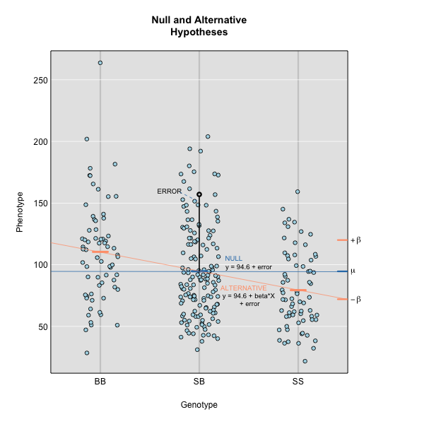

:::::::::::::::::::::::::::::::::::::: questions 

- How do I use a linear mixed model in a genome scan?
- How do different mapping and kinship calculation methods differ?

::::::::::::::::::::::::::::::::::::::::::::::::

::::::::::::::::::::::::::::::::::::: objectives

- Create a genome scan with a linear mixed model.
- Compare LOD plots for Haley-Knott regression and linear mixed model methods.
- Compare LOD plots for the standard kinship matrix with the 
leave-one-chromosome-out (LOCO) method.

::::::::::::::::::::::::::::::::::::::::::::::::


```{r load_dependencies, include=FALSE, warning=FALSE}
options(scipen = 1, digits = 3)
suppressPackageStartupMessages(library(qtl2))
cross <- read_cross2(file = 'https://thejacksonlaboratory.box.com/shared/static/svw7ivp5hhmd7vb8fy26tc53h7r85wez.zip')
probs <- calc_genoprob(cross = cross, map = cross$gmap, error_prob = 0.002)
kinship_loco  <- calc_kinship(probs = probs, type = 'loco')
# Covariates.
cross$covar$Sex <- factor(cross$covar$Sex)
addcovar <- model.matrix(~Sex, data = cross$covar)[,-1, drop = FALSE]
# LOD scan for insulin.
insulin <- cross$pheno[,'log10_insulin_10wk',drop = FALSE]
lod_add <- scan1(genoprobs = probs, pheno = insulin, addcovar  = addcovar)
# Chr 2 BLUPs.
chr2_eff = readRDS(url('https://thejacksonlaboratory.box.com/shared/static/kxsizeu1papwb0q21f1zjde8nx5lhxvg.rds'))
# Marker with maximum LOD on Chr 2.
chr2_max_mkr = 'rs13476803'
```

Genetic mapping in mice presents a good example of why accounting for population 
structure is important. Laboratory mouse strains are descended from a small 
number of founders (fancy mice) and went through several population bottlenecks. 
Wild-derived strains are not descended from fancy mice and don't share the same 
history as laboratory strains. 

 by Lee M. Silver, Oxford University Press, 1995.](https://www.informatics.jax.org/silver/images/figure2-3.gif){alt="A world map showing the origins and ranges of five Mus musculus subspecies: domesticus, musculus, castaneus, bactrianus and molossinus"}

 edited by Herbert C. Morse III, Academic Press, 1978. Permission from Elsevier. ](https://www.informatics.jax.org/morsebook/images/1-10as.jpg){alt="A genealogy chart showing the origin of commonly used inbred strains as Chinese, Japanese and English mouse fanciers. Abby Lathrop of Granby Mouse Farm supplied fancy mice to researchers including Marsh, C.C. Little, MacDowell, Castle and Strong in the early 1900s. These mice were developed into common inbred strains such as C57BL, 129, DBA and C3H strains."}

Issues of population structure and differing degrees of genetic relatedness 
between mice are addressed using linear mixed models (LMM).  LMMs consider 
genome-wide similarity between all pairs of individuals to account for 
population structure, known kinship and unknown relatedness. LMMs in mapping 
studies can successfully adjust for genetic relatedness between individuals in a 
population by incorporating kinship into the model. Earlier we 
[calculated a kinship matrix](https://smcclatchy.github.io/qtl-mapping/instructor/calc-kinship.html) 
for input to a linear mixed model to account for relationships among 
individuals. For a current review of mixed models in genetics, see
[Sul et al, PLoS Genetics, 2018](https://pmc.ncbi.nlm.nih.gov/articles/PMC6307707/).

Simple linear regression takes the form:

$y = \mu + \beta G + \epsilon$

which describes a line with slope $\beta$ and y-intercept $\mu$. The error 
(or residual) is represented by $\epsilon$.

To model the relationship between the phenotype $y$ and the genotypes at one
marker, we use:

$y_j = \mu + \beta_k G_{jk} + \epsilon_j$
 

where $y_j$ is the phenotype of the $j$th individual, $\mu$ is the mean 
phenotype value, $\beta_k$ is the effect of the $k$th genotype, $G_{jk}$ is the 
genotype for individual $j$, and $\epsilon_j$ is the error for the $j$th 
individual. In the figure below, $\mu$ equals 94.6, and $\beta$ equals 
15 for the alternative hypothesis (QTL exists). This linear model is 
$y$ = 94.6 + 15$G$ + $\epsilon$. The model intersects the genotype groups at their 
group means. In contrast, the null hypothesis would state that there is no 
difference in group means (no QTL anywhere). The linear model for the null 
hypothesis would be $y$ = 94.6 + 0$G$ + $\epsilon$. This states that the 
phenotype is equal to the combined mean (94.6), plus some error ($\epsilon$). In 
other words, genotype doesn't affect the phenotype.

{alt="Null versus alternative hypotheses"}

The linear models above describe the relationship between genotype and phenotype 
but are inadequate for describing the relationship between genotype and 
phenotype in large datasets. They don't account for relatedness among 
individuals. In real populations, the effect of a single genotype is influenced 
by many other genotypes that affect the phenotype. A  true genetic model takes 
into account the effect of all variants on the phenotype. 

To model the phenotypes of all individuals in the data, we can adapt the simple 
linear model to include all individuals and their variants so that we capture 
the effect of all variants shared by individuals on their phenotypes.

$y=\mu+\sum_{i=1}^M{\beta_iG_i}+\epsilon$

Now, $y$ represents the phenotypes of all individuals. The effect of the 
$i$th genotype on the phenotype is $\beta_i$, the mean is $\mu$ and the error 
is $\epsilon$. Here, the number of genotypes is M.

To model the effect of all genotypes and to account for relatedness, we test the 
effect of a single genotype while bringing all other genotypes into the model.

$y=\mu + \beta_kG_k +\sum_{i\neq k}^{M}\beta_iG_i + \epsilon$

$\beta_k$ is the effect of the genotype $G_k$, and $\sum_{i\neq k}^{M}\beta_iG_i$ 
sums the effects across all markers (M) of all other genotypes except genotype 
$k$. For the leave one chromosome out (LOCO) method, $\beta_kG_k$ is the effect 
of genotypes on chromosome $k$, and $\beta_iG_i$ represents the effects of 
genotypes on all other chromosomes.

If the sample contains divergent subpopulations, SNPs on different chromosomes 
will be correlated because of the  difference in allele frequencies between 
subpopulations caused by relatedness. To correct for correlations between 
chromosomes, we model all genotypes on the other chromosomes when testing for 
the association of a SNP. 

First, we will create a single kinship matrix using all of the genotype 
probabilities on all chromosomes.

```{r calc_kinship_all}
kinship_all <- calc_kinship(probs = probs, 
                            type = "overall")
```

To perform a genome scan using a linear mixed model you also use the function 
`scan1`; you just need to provide the argument `kinship`, a kinship matrix 
(or, for the LOCO method, a list of kinship matrices).

```{r scan1_pg}
lod_add_all <- scan1(genoprobs = probs, 
                     pheno     = insulin, 
                     kinship   = kinship_all, 
                     addcovar  = addcovar)
```

Again, on a multi-core machine, you can get some speed-up using the `cores` 
argument.

```{r scan1_pg_multicore, eval=FALSE}
lod_add_all <- scan1(genoprobs = probs, 
                     pheno     = insulin, 
                     kinship   = kinship_all, 
                     addcovar  = addcovar, 
                     cores     = 4)
```

Let's plot the insulin genome scan using the overall kinship matrix.

```{r plot_lod_all,fig.width=8,fig.height=6}
plot_scan1(x     = lod_add,  
           map   = cross$pmap,
           col   = 'black',
           main  = "log10(insulin): Kinship Comparison")
plot_scan1(x     = lod_add_all,  
           map   = cross$pmap,
           col   = 'blue',
           add   = TRUE)
legend(x = 1000, y = max(lod_add), legend = c('No kinship', 'Overall kinship'), 
       col = c('black', 'blue'), lwd = 2)
```

How did the LOD scores change? Did they increase or decrease? In general, the
LOD scores decreased. In some cases, the LOD score decreased drastically. Why
would this happen?

To answer this, we have to think back to the mapping model that we are using.

$y=\mu + \beta_kG_k +\sum_{i\neq k}^{M}\beta_iG_i + \epsilon$

In this model, we explicitly excluded the current marker from the kinship
calculation. However, when we calculated the kinship matrix above, we used
**ALL** of the markers. This means that we have put the current marker $k$ into
the model *twice*. This causes a loss of power which has been reported in
[Yang et al., Nat.Gen., 2014](https://pmc.ncbi.nlm.nih.gov/articles/PMC3989144/).

In order to address this issue, we could remove the current marker from the 
calculation. But this would mean that we would have to calculate a different
kinship matrix for every marker. As a compromise, researchers create a different
kinship matrix for each chromosome which uses all of the markers except those
on the current chromosome. For example, to create a kinship matrix to use on 
chromosome 1, we would use the markers on chromosomes 2 through X. This is
called the *Leave One Chromosome Out* (LOCO) method.

In order to use the LOCO method (scan each chromosome using a kinship matrix 
that is calculated using data from all other chromosomes), use `type="loco"` in 
the call to `calc_kinship()`.

```{r calc_kinship_loco}
kinship_loco <- calc_kinship(probs = probs, 
                             type  = "loco")
```

For the LOCO (leave one chromosome out) method, provide the list of kinship 
matrices as obtained from `calc_kinship()` with `method="loco"`.

```{r scan1_pg_loco}
lod_add_loco <- scan1(genoprobs = probs, 
                      pheno     = insulin, 
                      kinship   = kinship_loco, 
                      addcovar  = addcovar)
```

To plot the results, we again use `plot_scan1()`.

Here is a plot of the LOD scores by Haley-Knott regression and the linear mixed 
model using either the standard kinship matrix or the LOCO method.

```{r plot_lod_add_loco_all,fig.width=8,fig.height=6}
plot_scan1(x     = lod_add,      
           map   = cross$pmap, 
           col   = 'black',
           ylim  = c(0, 7.5))
plot_scan1(x     = lod_add_all,  
           map   = cross$pmap, 
           col   = 'blue',   
           add   = TRUE)
plot_scan1(x     = lod_add_loco, 
           map   = cross$pmap, 
           col   = 'darkgreen', 
           add   = TRUE)
legend(x = 1500, y = 7.5, legend = c("No kinship", "All kinship", "LOCO kinship"),
       lwd = 2, col = c('black', 'blue', 'darkgreen'))
```

For circulating insulin, the three methods give quite different results. The 
linear mixed model with an overall kinship matrix (blue) produces much lower LOD 
scores than the other two methods. On chromosomes with some evidence of a QTL, 
the LOCO method gives higher LOD scores than Haley-Knott, except on chromosome 6 
where it gives lower LOD scores.

Let's plot the difference between the LOCO-kinship genome scan and the 
no-kinship genome scan.

```{r plot_loco_none,fig.width=8,fig.height=6}
plot(x    = lod_add_loco - lod_add, 
     map  = cross$pmap, 
     ylim = c(-1.5, 2),
     main = "LOCO - no kinship Genome Scan")
```

As you can see from the plot above, the LOCO-kinship scan generally produces
higher LOD scores. While higher LOD scores don't always mean that the model is
better, in this case, we expect that accounting for the correlation in residual
errors using kinship matrices will produce more correct results.

::::::::::::::::::::::::::::::::::::: challenge 

## Challenge 1

What are the benefits and disadvantages of the three methods for genome scanning
(Haley-Knott regression, kinship matrix, and leave-one-chromosome out (LOCO)?)  
Which method would you use to scan, and why?  
Think about the advantages and disadvantages of each, discuss with a neighbor, 
and share your thoughts in the collaborative document.

:::::::::::::::::::::::: solution 

Haley-Knott regression does not consider the kinship between mice. This may
increase or decrease the LOD score and least to false or missed discoveries.
Including a kinship matrix which uses all of the markers in the mapping model 
causes a loss of power because the marker is fit twice in the model. A 
compromise approach is to create a separate kinship matrix for each chromosome
which uses all of the markers expect those on the current chromosome. This
estimates kinship while preventing the current marker from being in the model
twice. The LOCO method leads to better power to identify QTL.

:::::::::::::::::::::::::::::::::
::::::::::::::::::::::::::::::::::::::::::::::::

::::::::::::::::::::::::::::::::::::: challenge 

## Challenge 2: Pair programming

With a partner, review and carry out all of the steps in QTL mapping that we 
have covered so far, using a new data set. One of you types the code, the other
explains what needs to happen next, finds the relevant code in the lesson, 
suggests new names for objects (i.e. NOT the ones you've already used, such as 
`map`, `pr`, `out`, `prob`, etc.).

1. Load the [Gough data](https://github.com/rqtl/qtl2data/tree/main/Gough) 
into an object called `gough`. You can find code to load the data at the bottom
of the page.
2. Calculate genotype probabilities.
3. Run a genome scan for the first 16 phenotypes using 
`pheno = gough$pheno[, 1:16]`. These represent 16 weeks of body weight 
measurements. The remaining phenotypes are derivations of these measurements.
4. Calculate a kinship matrix.
5. Calculate a list of kinship matrices with the LOCO method.
6. Run genome scans with the regular kinship matrix and with the list of LOCO 
matrices.
7. Plot the 3 different genome scans in a single plot in different colors. By
default, the `plot()` function will give you the first lod column which is for
week 1. You can add the `lodcolumn =  ` argument to the call to plot and insert
additional lod column numbers up to 16.
8. Which chromosomes appear to have peaks with a LOD score greater than 7? 
Which methods identify these peaks? Which don't?

:::::::::::::::::::::::: solution 

`file <- paste0("https://raw.githubusercontent.com/rqtl/", "qtl2data/main/Gough/gough.zip")`   
`gough <- read_cross2(file)`    
`summary(gough)`  
`head(goughpheno)`  
`colnames(gough$pheno)`  
`goughmap <- gough$pmap`   
`prgough <- calc_genoprob(cross=gough, map=goughmap, error_prob=0.002)`  
`goughaddcovar <- get_x_covar(gough)`  
`goughscan <- scan1(genoprobs = prgough, pheno = gough$pheno[, 1:16], addcovar=goughaddcovar)`  
`plot(goughscan, map = goughmap)`  
`goughkinship <- calc_kinship(probs = prgough)`  
`out_pg_gough <- scan1(prgough, bgough$pheno, kinship=goughkinship, addcovar=goughaddcovar)`  
`kinship_loco_gough <- calc_kinship(prgough, "loco")`  
`out_pg_loco_gough <- scan1(prgough, gough$pheno, kinship_loco_gough, addcovar=goughaddcovar)`  
`plot_scan1(out_pg_loco_gough, map = goughmap, lodcolumn = 2, col = "black")`  
`plot_scan1(out_pg_gough, map = goughmap, lodcolumn = 2, col = "blue", add = TRUE)`  
`plot_scan1(goughscan, map = goughmap, lodcolumn = 2, col = "green", add = TRUE)`  


:::::::::::::::::::::::::::::::::

::::::::::::::::::::::::::::::::::::::::::::::::


::::::::::::::::::::::::::::::::::::: keypoints 

- To perform a genome scan with a linear mixed model, supply a kinship matrix.
- Different mapping and kinship calculation methods give different results.
- Using a set of Leave-One-Chromosome-Out kinship matrices generally produces
higher LOD scores than other methods.

::::::::::::::::::::::::::::::::::::::::::::::::
