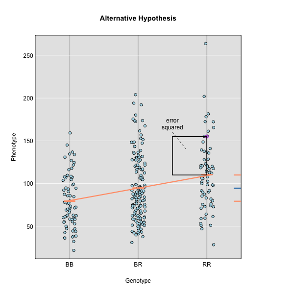
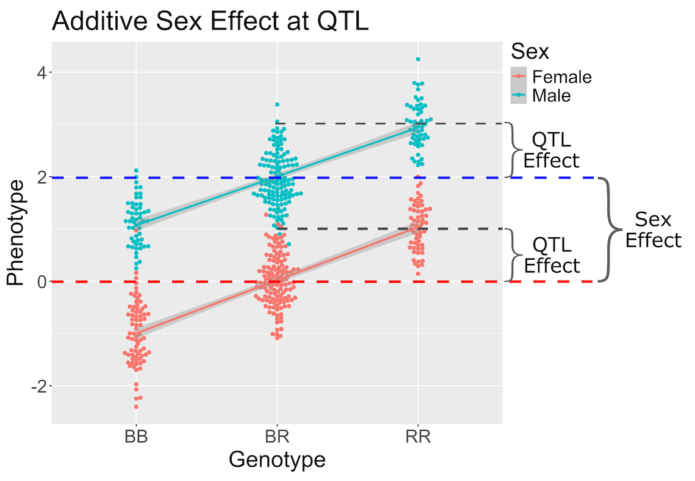
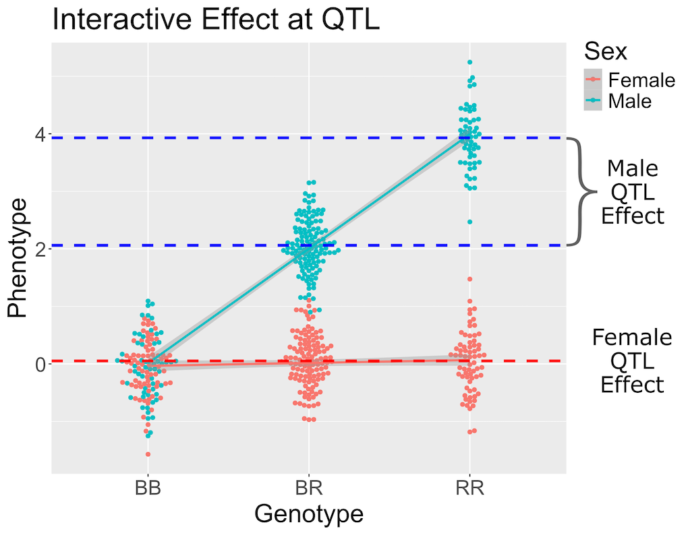

:::::::::::::::::::::::::::::::::::::: questions 

- How do I perform a genome scan?
- How do I plot a genome scan?
- How do additive covariates differ from interactive covariates?

::::::::::::::::::::::::::::::::::::::::::::::::

::::::::::::::::::::::::::::::::::::: objectives

- Map one trait using additive covariates.
- Map the sample trait using additive and interactive covariates.
- Plot a genome scan.

::::::::::::::::::::::::::::::::::::::::::::::::


```{r load_dependencies, include=FALSE, warning=FALSE}
suppressPackageStartupMessages(library(qtl2))
cross <- read_cross2(file = 'https://thejacksonlaboratory.box.com/shared/static/svw7ivp5hhmd7vb8fy26tc53h7r85wez.zip')
probs <- calc_genoprob(cross = cross, map = cross$gmap, error_prob = 0.002)
```

The freely available chapter on 
[single-QTL analysis](http://www.rqtl.org/book/rqtlbook_ch04.pdf) 
from Broman and Sen's 
[A Guide to QTL Mapping with R/qtl](http://www.rqtl.org/book/) describes 
different methods for QTL analysis. 

Linear regression can be employed to identify presence of QTL in a cross. To 
identify QTL using regression, we compare the fit for two models: 1) the null 
hypothesis that there are no QTL anywhere in the genome; and 2) the alternative 
hypothesis that there is a QTL near a specific position. A sloped line indicates 
that there is a difference in mean phenotype between the two genotype groups, 
and that a QTL is present. A line with no slope indicates that there is no 
difference in mean phenotype between the two groups, and that no QTL exists. 
Regression aims to find the line of best fit to the data. In the case of a 
backcross with only two genotypes, a t-test is performed at the marker to 
determine whether the difference in phenotype means is zero.


To find the line of best fit, the residuals or errors are calculated, then 
squared for each data point.




The line of best fit will be the one that minimizes the sum of squared 
residuals, which maximizes the likelihood of the data. 

Marker regression produces a LOD (logarithm of odds) score comparing the null 
hypothesis to the alternative. The LOD score is calculated using the sum of 
squared residuals for the null and alternative hypotheses. The LOD score is the 
difference between the log10 likelihood of the null hypothesis and the log10 
likelihood of the alternative hypothesis. It is related to the regression model 
above by identifying the line of best fit to the data. A higher LOD score 
indicates greater likelihood of the alternative hypothesis. A LOD score closer 
to zero favors the null hypothesis. 

Marker regression can identify the existence and effect of a QTL by comparing 
means between groups, however, it requires known marker genotypes and can't 
identify QTL in between typed markers. To identify QTL between typed markers, we 
use Haley-Knott regression. After 
[calculating genotype probabilities](https://smcclatchy.github.io/qtl-mapping/calc-genoprob.html), 
we can regress the phenotypes for animals of unknown genotype on these 
conditional genotype probabilities (conditional on known marker genotypes). In 
Haley-Knott regression, phenotype values can be plotted and a regression line 
drawn through the phenotype mean for the untyped individuals.


As shown by the green circle in the figure, an individual of unknown genotype is 
placed between known genotypes according to the probability of its genotype 
being BB or BR. In this case, the probability of this individual having genotype
BB is 0.6, and the probability of having genotype BR is 0.4.

To perform a genome scan by Haley-Knott regression
([Haley and Knott 1992](https://www.ncbi.nlm.nih.gov/pubmed/16718932)),
use the function `scan1()`.  `scan1()` takes as input the genotype 
probabilities, a matrix of phenotypes, and then optional additive and 
interactive covariates. Another option 
is to provide a vector of weights.

## Additive Genome Scan

There are two potential covariates in the Attie data set. Let's look at the
top of the covariates in the `cross` object.

```{r view_covar}
head(cross$covar)
```

`Sex` is potential covariate. It is a good idea to always include
sex in any analysis. Even if you perform an ANOVA and think that sex is not 
important, it doesn't hurt to add in one extra degree of freedom to your model.
Examples of other covariates might be age, diet, treatment, or experimental 
batch. It is worth taking time to identify covariates that may affect your 
results.

First, we will make sex a "factor", which is the term that R uses for 
categorical variables. This is required for the next function to 
work correctly. Then we will use `model.matrix` to create a matrix of "dummy"
variables which encode the sex of each mouse.

```{r make_addcovar}
cross$covar$Sex <- factor(cross$covar$Sex)

addcovar <- model.matrix(~Sex, data = cross$covar)[,-1, drop = FALSE]
```


When we perform a genome scan with additive covariates, we are searching for loci
that have the same effect in both covariate groups. In this case, we are 
searching for loci that affect females and male in the same way.

{alt="Figure showing sex and additive QTL effects.",width=50%}

In the figure above, we plotted simulated phenotype values versus the 
genotypes BB, BR and RR. Each point represents one mouse, with females shown in
red and males in blue. We show the sex effect at the mean of each sex group.
The difference between sexes is the same for all three genotype groups. This is
different from the QTL effect, which is the difference between the mean of each
sex and the homozygous group(s).

When we add sex into the model as an additive covariate, we regress the sex 
effect out of the phenotype data and then estimate the overall QTL effect. 

{alt="Figure showing sex and additive QTL effects.",width=50%}

In the figure above, we have plotted the same simulated phenotype with sex
regressed out. Now the female and male means are the same, but the QTL effect
remains.

With that introdution to additive covariates, let's map the insulin phenotype.

First, we will make a data.frame called "insulin" so that we don't have to type
quite as many characters every time that we map insulin.

```{r create_insulin}
insulin = cross$pheno[,'log10_insulin_10wk', drop = FALSE]
```

Next, we will use the qtl2 function `scan1` to map insulin values across the
genome with sex as an additive covariate.

```{r add_scan1}
lod_add <- scan1(genoprobs = probs, 
                 pheno     = insulin, 
                 addcovar  = addcovar)
```

On a multi-core machine, you can get some speed-up via the `cores` argument, as 
with `calc_genoprob()` and `calc_kinship()`.

```{r add_scan1_multicore, eval=FALSE}
lod_add <- scan1(genoprobs = probs, 
                 pheno     = insulin, 
                 addcovar  = addcovar,
                 cores     = 4)
```

The output of `scan1()` is a matrix of LOD scores, with markers in rows and
phenotypes in columns. 

Take a look at the first ten rows of the scan object. The numerical values are 
the LOD scores for the marker named at the beginning of the row. 
LOD values are shown for circulating insulin.

```{r head_scan1}
head(lod_add, n = 10)
```

The function `plot_scan1()` can be used to plot the LOD curves. If you have 
more than one phenotype, use the `lodcolumn` argument to indicate which column 
to plot. In this case, we have only one column and `plot_scan` will plot it by
default.

```{r plot_add_lod,fig.width=8,fig.height=6}
plot_scan1(lod_add, 
           map  = cross$pmap,
           main = 'log(insulin): 10 weeks')
```

The LOD plot for insulin shows several peaks, with the largest peak on 
chromosome 2. There are smaller peaks on other chromosomes. Which of these peaks is 
significant, and why? We'll evaluate the significance of genome scan results in 
a later episode in 
[Finding Significant Peaks via Permutation](https://smcclatchy.github.io/qtl-mapping/perform-perm-test/).

::::::::::::::::::::::::::::::::::::: challenge 

## Challenge 1: Find the marker with the highest LOD.

1. What is the highest LOD score for insulin?
2. Which marker does the highest LOD score occur at?

:::::::::::::::::::::::: solution 

1. You can find the maximum LOD score using the `max` function.

```{r challenge1a}
max(lod_add[,'log10_insulin_10wk'])
```

2. You can find the marker name with the maximum LOD score using the `which.max` 
function.

```{r challenge1b}
rownames(lod_add)[which.max(lod_add[,'log10_insulin_10wk'])]
```

:::::::::::::::::::::::::::::::::
::::::::::::::::::::::::::::::::::::::::::::::::

::::::::::::::::::::::::::::::::::::: challenge 

## Challenge 2: Find the chromosome and position of the maximum LOD score.

Look up the `qtl2` function `find_markerpos` in the Help and find the chromosome
and Mb position of the marker with the maximum LOD.

:::::::::::::::::::::::: solution 

```{r challenge2}
max_mkr <- rownames(lod_add)[which.max(lod_add[,'log10_insulin_10wk'])]
find_markerpos(cross = cross, markers = max_mkr)
```

:::::::::::::::::::::::::::::::::

## Challenge 3: Plot the LOD on specific chromosomes.

The `plot_scan1` function has a "chr" argument that allows you to only plot
specific chromosomes. Use this to plot the insulin LOD on chromosomes 2, 7, 12,
and 19. Add a title to the plot using the "main" argument, which is part of 
the basic plotting function.

:::::::::::::::::::::::: solution 

```{r challenge3,fig.width=8,fig.height=6}
plot_scan1(lod_add, map = cross$pmap, chr = c(2, 7, 12, 19),
           main = "log(insulin): 10 weeks")
```

:::::::::::::::::::::::::::::::::
::::::::::::::::::::::::::::::::::::::::::::::::

## Interactive Genome Scan

Above, we mapped insulin levels using sex as an additive covariate and searched
for loci where both sexes had the same QTL effect. But what if the two sexes 
have different effects? You might think that we could map each sex separately.
But this approach reduces your sample size, and hence statistical power, in 
each sex. A better way is to use all of the data and map with sex as an 
additive and an interactive covariate. Mapping with an interactive covariate
allows each sex to have different effects. We do this by including sex as an
interactive covariate in the genome scan.

{alt="Figure showing interactive sex by  QTL effects",width=50%}

In the figure above, female (red) and male (blue) phenotypes are plotted versus
the three genotypes. In females, there is no QTL effect because the mean values
in each genotype group are not different. In males, there is a QTL effect
because the mean in each genotype group changes.

You should always include an interactive covariate as an additive covariates as
well. In this case, we only have sex as a covariate, so we can use the additive
covariate matrix for the interactive covariate. For clarity, we will make a copy
and name it for the interactive covariates.

```{r make_intcovar}
intcovar = addcovar
```


```{r inter_scan1}
lod_int <- scan1(genoprobs = probs, 
                 pheno     = insulin, 
                 addcovar  = addcovar,
                 intcovar  = intcovar)
```


```{r plot_int,fig.width=8,fig.height=6}
plot_scan1(x    = lod_int, 
           map  = cross$pmap, 
           main = 'log(insulin): 10 weeks: Sex Interactive')
```

It is difficult to tell if there is a difference in LOD scores between the 
additive and interactive scans. To resolve this, we can plot both genome scans
in the same plot using the "add = TRUE" argument. We will also color the 
additive scan in blue.

```{r plot_add_int_lod,fig.width=8,fig.height=6}
plot_scan1(x    = lod_int, 
           map  = cross$pmap, 
           main = 'log(insulin): 10 weeks')
plot_scan1(x    = lod_add, 
           map  = cross$pmap, 
           col  = 'blue', 
           add  = TRUE)
legend(x = 1000, y = 7.6, legend = c('Additive', 'Interactive'), 
       col = c('blue', 'black'), lwd = 2)
```

It is still difficult to tell whether any peaks differ by sex. Another way 
to view the plot is to plot the difference between the interactive and additive
scans.

```{r plot_add_int_diff_lod,fig.width=8,fig.height=6}
plot_scan1(x    = lod_int - lod_add, 
           map  = cross$pmap,
           main = 'log10(insulin): Interactive - Additive')
```

While it was important to look at the effect of sex on the trait, in this 
experiment, there do not appear to be any sex-specific peaks. Without performing
a formal test, we usually look for peaks with a LOD greater than 3 and there do
not appear to be any in this scan.

<!-- DMG: Add challenge asking students why we didn't map and plot females and
males separately. Maybe they can even try it. -->

::::::::::::::::::::::::::::::::::::: keypoints 

- A qtl2 genome scan requires genotype probabilities and a phenotype matrix.
- The output from a genome scan contains a LOD score matrix, map positions, and 
phenotypes.
- LOD curve plots for a genome scan can be viewed with plot_scan1().
- A genome scan using sex as an additive covariate searches for QTL which affect
both sexes.
- A genome scan using sex as an interactive covariate searches for QTL which 
affect each sex differently.


::::::::::::::::::::::::::::::::::::::::::::::::

