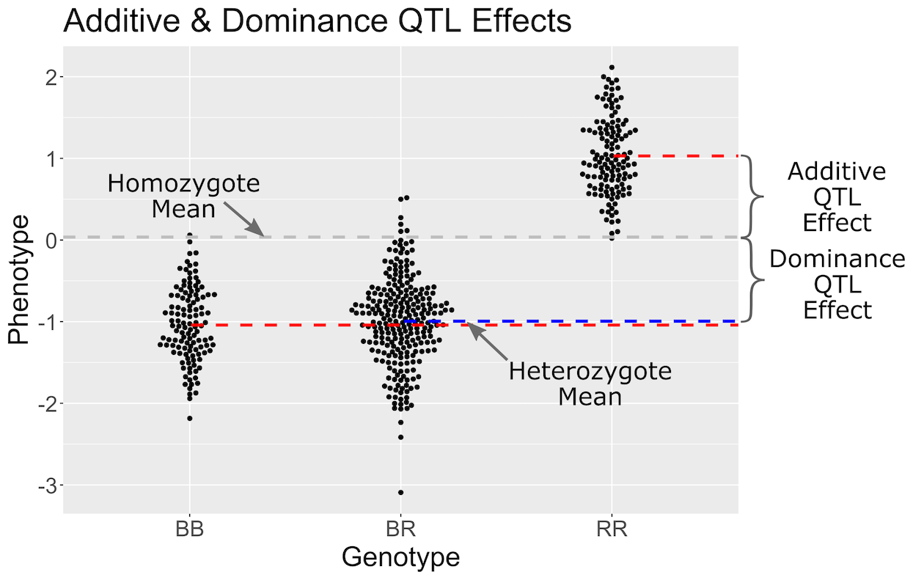
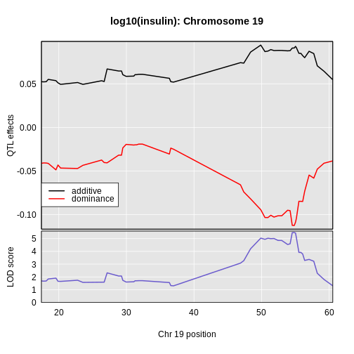

:::::::::::::::::::::::::::::::::::::: questions 

- How do I find the founder allele effects at a QTL peak?

::::::::::::::::::::::::::::::::::::::::::::::::

::::::::::::::::::::::::::::::::::::: objectives

- Estimate the founder allele effects at a QTL peak.
- Plot the estimated founder allele effects.

::::::::::::::::::::::::::::::::::::::::::::::::


## Estimating Founder Allele Effects

<!-- DMG: Sue, can you make the equations Latex and remake the figures
with the BTBR data? -->

Recall that to model data from a cross, we use

$y_j = \mu + \beta_k G_{jk} + \epsilon_j$

where $y_{ij}$ is the phenotype of the $j$th individual, $\mu$ is the mean 
phenotype value, $\beta_k$ is the effect of the $k$th genotype, $G_{jk}$ is the 
genotype for individual $j$, and $\epsilon_j$ is the error for the $j$th 
individual. In the figure below, $\mu$ equals 1, 
and $\beta$ equals 0.1 for the alternative 
hypothesis (QTL exists).

{alt="Null and alternative hypothesis"}

This linear model is <i>y</i> = 1 + 
0.1X + &epsilon;. The model intersects the 
genotype groups at their group means, and is based on &mu; and 
<i>&beta;<sub>k</sub></i> for chromosome 2 marker rs13476803 located at 
138.945 Mb.  

The effect of genotype RR (the &beta; for the 
RR genotype) at marker rs13476803 is 
0.1, while the effect of the 
BB genotype is -0.1 on 
the insulin phenotype. The effect of the BR genotype 
is 0 relative to $\mu$ equals 
1.

The `scan1()` function returns only LOD scores. To obtain estimated QTL effects,
use the function `scan1coef()`. This function takes a single phenotype and the 
genotype probabilities for a single chromosome and returns a matrix with the 
estimated coefficients at each putative QTL location along the chromosome.

For example, to get the estimated QTL effects on chromosome 19 for the insulin 
phenotype, we would provide the chromosome 19 genotype probabilities and the 
insulin phenotype to the function `scan1coef()` as follows:


``` r
chr       <- "19"
eff_chr19 <- scan1coef(genoprobs = probs[,chr], 
                       pheno     = insulin,
                       kinship   = kinship_loco[[chr]],
                       addcovar  = addcovar)
```


The result is a matrix of 50 positions $\times$ 3 genotypes.
Additional columns contain the sex and intercept values ($\mu$).


``` r
head(eff_chr19)
```

``` output
                BB      BR     RR SexMale intercept
rs4232073  -0.0387 -0.0275 0.0661  -0.169      1.01
rs13483548 -0.0386 -0.0272 0.0658  -0.168      1.01
rs13483549 -0.0388 -0.0272 0.0660  -0.169      1.01
rs13483550 -0.0413 -0.0275 0.0688  -0.169      1.01
rs13483554 -0.0374 -0.0325 0.0698  -0.170      1.01
rs13483555 -0.0367 -0.0288 0.0655  -0.170      1.01
```

## Plotting Founder Allele Effects Along a Chromosome

To plot the QTL effects, use the `plot_coef()` function. Add the LOD plot to 
the `scan1_output` argument to include a LOD plot at the bottom.


``` r
plot_coef(x            = eff_chr19, 
          map          = cross$pmap,
          scan1_output = lod_add_loco, 
          legend       = "topleft")
```


The plot shows effect values on the y-axis and cM values on the x-axis. The
value of the intercept ($\mu$) appears at the top. The effect of the 
BR genotype is centered around zero, with the
effects of the other two genotypes above and below. We are usually not 
directly interested in how the additive covariates change across the genome, 
but rather, the the founder allele effects change.

To plot only the founder allele effects, use the argument `columns` to indicate
which coefficients to plot. Let's look at the columns which contain the founder 
allele effects.


``` r
head(eff_chr19)
```

``` output
                BB      BR     RR SexMale intercept
rs4232073  -0.0387 -0.0275 0.0661  -0.169      1.01
rs13483548 -0.0386 -0.0272 0.0658  -0.168      1.01
rs13483549 -0.0388 -0.0272 0.0660  -0.169      1.01
rs13483550 -0.0413 -0.0275 0.0688  -0.169      1.01
rs13483554 -0.0374 -0.0325 0.0698  -0.170      1.01
rs13483555 -0.0367 -0.0288 0.0655  -0.170      1.01
```

We would like to plot the columns "BB", "BR", and "RR", which are in columns
1 through 3. This is what we pass into the `columns` argument.


``` r
plot_coef(x       = eff_chr19, 
          map     = cross$pmap, 
          columns = 1:3, 
          scan1_output = lod_add_loco, 
          main    = paste("Chromosome", chr, "QTL effects and LOD scores"),
          legend  = "topleft")
```


::::::::::::::::::::::::::::::::::::: challenge 

## Challenge 1: Founder Allele Effects

Looking at the plot above, which founder allele contributes to higher 
insulin levels?

:::::::::::::::::::::::: solution 

The BTBR allele contributes to higher insulin levels because the "RR" 
allele effect (green line) is higher than the other allele effect lines.

:::::::::::::::::::::::::::::::::
::::::::::::::::::::::::::::::::::::::::::::::::

## Estimating Founder Allele Effects using BLUPs

Another option for estimating the founder allele effects is to treat them as 
[random effects](https://stats.stackexchange.com/questions/4700/what-is-the-difference-between-fixed-effect-random-effect-and-mixed-effect-mode#151800) 
and calculate 
[Best Linear Unbiased Predictors](https://en.wikipedia.org/wiki/Best_linear_unbiased_prediction) 
(BLUPs). This is particularly valuable for multi-parent populations such as the 
Collaborative Cross and Diversity Outbred mice, where the large number of 
possible genotypes at a QTL leads to considerable variability in the effect 
estimates. To calculate BLUPs, use `scan1blup()`; it takes the same arguments 
as `scan1coef()`, including the option of a kinship matrix to account for a 
residual polygenic effect.


``` r
blup_chr19 <- scan1blup(genoprobs = probs[,chr], 
                        pheno     = insulin,
                        kinship   = kinship_loco[[chr]],
                        addcovar  = addcovar)
```

We can plot the BLUP effects using `plot_coef` as before.


``` r
plot_coef(x       = blup_chr19, 
          map     = cross$pmap, 
          columns = 1:3, 
          scan1_output = lod_add_loco, 
          main    = paste("Chromosome", chr, "QTL BLUP effects and LOD scores"),
          legend  = "topleft")
```


In the plot below, we plotted the founder allele effects (solid lines) and the 
BLUPs (dashed lines). In this case, the effects are not greatly different, but 
the effects are "shrunken" toward zero. 


``` r
plot_coef(x       = eff_chr19, 
          map     = cross$pmap, 
          columns = 1:3, 
          main    = paste("Chromosome", chr, "QTL BLUP effects and LOD scores"),
          legend  = "topleft")
plot_coef(x       = blup_chr19, 
          map     = cross$pmap, 
          columns = 1:3,
          lty     = 2,
          legend  = "topleft",
          add     = TRUE)
```


## Plotting Allele Effects at One Marker

You may also want plot the founder allele effects at the marker with the
highest LOD. To do this, you first need to get the position of the marker from
the peak list.


``` r
peaks <- find_peaks(scan1_output = lod_add_loco,
                    map          = cross$pmap,
                    threshold    = thr)
peaks
```

``` output
  lodindex          lodcolumn chr   pos  lod
1        1 log10_insulin_10wk   2 138.9 7.13
2        1 log10_insulin_10wk   7 144.2 5.72
3        1 log10_insulin_10wk  12  25.1 4.31
4        1 log10_insulin_10wk  14  22.2 3.97
5        1 log10_insulin_10wk  16  80.4 4.11
6        1 log10_insulin_10wk  19  54.8 5.48
```

The position of the maximum LOD on chromosome 19 is 
54.83 Mb. We can pass this value into the `qtl2` 
function `pull_genoprobpos` to get the genoprobs at this marker.


``` r
max_pos <- subset(peaks, chr == '19')$pos
max_mkr <- find_marker(map = cross$pmap, 
                       chr = chr, 
                       pos = max_pos)

pr      <- pull_genoprobpos(genoprobs = probs, 
                            marker    = max_mkr)
```

::::::::::::::::::::::::::::::::::::: challenge 

## Challenge 2: Structure of Genoprobs at One Marker

What does the structure of `pr` look like? 
How many rows and columns does it have?

:::::::::::::::::::::::: solution 

The [str](https://www.rdocumentation.org/packages/utils/versions/3.6.2/topics/str)
function provides the structure of an R object.


``` r
str(pr)
```

``` output
 num [1:490, 1:3] 1.09e-08 1.09e-08 3.06e-14 1.09e-08 1.09e-08 ...
 - attr(*, "dimnames")=List of 2
  ..$ : chr [1:490] "Mouse3051" "Mouse3551" "Mouse3430" "Mouse3476" ...
  ..$ : chr [1:3] "BB" "BR" "RR"
```

In this case, we can see that `pr` is a numeric matrix because the first line
starts with "num". The next item on the first line provides the dimensions of
the object. `pr` is a matrix because there are two dimensions, rows and columns.
There are 490 rows and 3 columns in `pr`.

:::::::::::::::::::::::::::::::::

## Challenge 3: Genoprobs at One Marker

Look at the top few rows of `pr`. You may want to round the values to make them
easier to read. What is the genotype of "Mouse3051"? What about "Mouse3430"?

:::::::::::::::::::::::: solution 

We can use the [head]() function to see the top few rows of `pr`.


``` r
head(round(pr))
```

``` output
          BB BR RR
Mouse3051  0  1  0
Mouse3551  0  1  0
Mouse3430  0  0  1
Mouse3476  0  1  0
Mouse3414  0  1  0
Mouse3145  0  1  0
```

From the listing above, the probability that Mouse3051 carries the "BR" genotype
at this marker is close to 1, so this is the most likely genotype.

the probability that Mouse3430 carries the "RR" genotype at this marker is close
to 1.

:::::::::::::::::::::::::::::::::
::::::::::::::::::::::::::::::::::::::::::::::::

`pr` is a numeric matrix with 490 rows and 3 columns. The
rownames contain the mouse IDs and the column names contain the genotypes.

We can then pass `pr` as an argument into the `fit1` function, which fits
the mapping model at a single marker.


``` r
mod = fit1(genoprobs = pr,
           pheno     = insulin,
           kinship   = kinship_loco[[chr]], 
           addcovar  = addcovar)
```

Then, we can plot the founder allele effects and their standard error.


:::::::::::::::::::::::::::::::::::: instructor

Don't have the students type all of this. Copy and paste or show this code 
in a web browser.

:::::::::::::::::::::::::::::::::::::::::::::::


``` r
mod_eff = data.frame(eff = mod$coef, 
                     se  = mod$SE) |>
           rownames_to_column("genotype") |>
           filter(genotype %in% c("BB", "BR", "RR"))

ggplot(data    = mod_eff, 
       mapping = aes(x = genotype, y = eff)) +
  geom_pointrange(mapping = aes(ymin = eff - se, 
                                ymax = eff + se),
                  size       = 1.5,
                  linewidth  = 1.25) +
  labs(title = paste("Founder Allele Effects on Chr", chr),
       x     = "Genotype", y = "Founder Allele Effects") +
  theme(text = element_text(size = 20))
```


::::::::::::::::::::::::::::::::::::: challenge 

## Challenge 4: Allele Effects

1. In the plot above, which founder allele contributes to higher insulin levels?
2. Is that consistent with the plot created using `plot_coef` above?

:::::::::::::::::::::::: solution 

1. The R (BTBR) allele contributes to higher insulin levels on chromosome 19.
2. Yes, the BTBR allele also contributed to higher insulin level in the founder
allele effects plot.

:::::::::::::::::::::::::::::::::

## Challenge 5: Allele Effects on Chromosome 7

1. Use `scan1_blup` and `plot_coef` to look at the founder allele effects at the
chromosome 7 QTL peak. Does the pattern of allele effects look different? Which
founder allele contributes to higher insulin levels?
2. Get the genoprobs at the marker with the highest LOD on chromosome 7 and use
`fit1` and the plotting code for `fit1` above to examine the founder allele 
effects at the peak marker. Again, how do these allele effects differ from the
allele effects on chromosome 19? Which founder allele contributes to higher 
insulin levels?

Be careful to rename the ouput objects so that you don't overwrite the values
from chromosome 19.

:::::::::::::::::::::::: solution 

1. We will use `scan1_blup` and `plot_coef` to estimate the founder allele 
effects on chromosome 7.


``` r
blup_chr7 <- scan1blup(genoprobs = probs[,"7"],
                       pheno     = insulin,
                       kinship   = kinship_loco[["7"]],
                       addcovar  = addcovar)
plot_coef(x       = blup_chr7, 
          map     = cross$pmap, 
          columns = 1:3, 
          scan1_output = lod_add_loco, 
          main    = paste("Chromosome", "7", "QTL BLUP effects and LOD scores"),
          legend  = "topleft")
```


On chromosome 19, the BB and BR genotypes seems to have the same effect. On chromosome 7,
there is a clear split between the BB, BR, and RR genotypes. Each additional B allele
raises insulin levels.
The C57BL/6J (B) allele contributes to higher insulin levels.

2. We will get the marker with the highest LOD on chromosome 7, then get the 
genoprobs at that marker and use them in `fit1` to estimate the founder allele 
effects.


``` r
max_pos <- subset(peaks, chr == "7")$pos
max_mkr <- find_marker(map = cross$pmap, 
                       chr = "7", 
                       pos = max_pos)

pr7     <- pull_genoprobpos(genoprobs = probs, 
                            marker    = max_mkr)
```


``` r
mod7 = fit1(genoprobs = pr7,
            pheno     = insulin,
            kinship   = kinship_loco[["7"]], 
            addcovar  = addcovar)
```


``` r
mod_eff7 = data.frame(eff = mod7$coef, 
                      se  = mod7$SE) |>
            rownames_to_column("genotype") |>
            filter(genotype %in% c("BB", "BR", "RR"))

ggplot(data    = mod_eff7, 
       mapping = aes(x = genotype, y = eff)) +
  geom_pointrange(mapping = aes(ymin = eff - se, 
                                ymax = eff + se),
                  size       = 1.5,
                  linewidth  = 1.25) +
  labs(title = paste("Founder Allele Effects on Chr", "7"),
       x     = "Genotype", y = "Founder Allele Effects") +
  theme(text = element_text(size = 20))
```


On chromosome 19, mice carrying the BB and BR genotypes had almost the same 
levels of insulin. On chromosome 7, the BB genotype has the highest insulin
levels, the BR genotype has the next highest, and the RR genotype has the
lowest insulin levels.

:::::::::::::::::::::::::::::::::
::::::::::::::::::::::::::::::::::::::::::::::::

## Estimating Additive and Dominant Allele Effects

You may have noticed the difference in the pattern of allele effects between
chromosome 7 and 19. On chromosome 7, adding each "B" allele increased insulin
levels by the same amount. On chromosome 19, adding one "R" allele did not
change insulin levels. We saw an increase in insulin only when we added two
"R" alleles.

What we are seeing between these two QTL are "additive" and "dominant" effects.
At an additive QTL (which is different from additive covariates), adding (or
subtracting) one allele produces the same effect between each genotype. At a
dominant QTL, adding (or subtracting) two alleles is required to see the effect.
You can also have QTL which are a mixture of additive and dominant effects.

We can map the additive and dominance effects by providing a matrix of 
_contrasts_ to indicate the different effects. Let's look at the additive and
dominant effects on chromosome 7 first.

{alt="Figure showing additive & dominance QTL effects",width=50%}

In the figure above, we have simulated a QTL with a dominant effect. Genotypes
are shown on the X-axis and the phenotype on the Y-axis. Each point represents
the phenotype value for one mouse. The grey line is the mean of the two 
homozygote groups. The additive effect is defined as the difference between
the homozygote mean (grey line) and the individual homozygote group means (red
lines). The blue line shows the heterozygote mean. The dominance effect is the
difference between the homozygote mean (grey line) and the heterozygote mean
(blue line).

First, we create a "contrasts" matrix to indicate the mean, additive, and 
dominance effects that we want to estimate.


``` r
add_dom_contr <- cbind(mu = c( 1, 1, 1), 
                       a  = c(-1, 0, 1), 
                       d  = c( 0, 1, 0))
```


``` r
c7effB <- scan1coef(genoprobs = probs[,"7"], 
                    pheno     = insulin,
                    kinship   = kinship_loco[["7"]],
                    addcovar  = addcovar,
                    contrasts = add_dom_contr)
```

The result will then contain the estimates of `mu`, `a` (the additive effect), 
and `d` (the dominance effect). 


``` r
dim(c7effB)
```

``` output
[1] 109   4
```

``` r
head(c7effB)
```

``` output
             mu       a        d SexMale
rs8252589  1.01 -0.0267 -0.00378  -0.175
rs13479104 1.01 -0.0228  0.00409  -0.175
rs13479112 1.01 -0.0234  0.00991  -0.175
rs13479114 1.00 -0.0226  0.01148  -0.175
rs13479120 1.01 -0.0238  0.00899  -0.175
rs13479124 1.01 -0.0219  0.00375  -0.175
```

For marker rs13479570, `mu`, `a`, and `d` are 1.016, -0.111, -0.03, -0.164.

Here's a plot of the chromosome 7 additive and dominance effects, which are in 
the second and third columns.


``` r
plot_coef(x       = c7effB, 
          map     = cross$pmap["7"], 
          columns = 2:3, 
          col     = 1:2,
          scan1_output = lod_add_loco,
          main    = "log10(insulin): Chromosome 7")
legend('bottomleft', lwd = 2, col = 1:2, legend = c("additive", "dominance"))
```


In the plot above, the dominance effects remain near zero across the chromosome.
The additive effects decrease as we move 

:::::::::::::::::::::::::::::::::::::::::::::::: challenge

## Challenge 6: Estimating Additive and Dominance Effects on Chromsome 19

Use the code above to estimate and plot the additive and dominance effects along
chromosome 19. You can use the same contrasts matrix as before. 
How dow they differ from the effects on chromosome 7?

::::::::::::::::::: solution

First we estimate the effects using `scan1coef`.


``` r
c19effB <- scan1coef(genoprobs = probs[,"19"], 
                     pheno     = insulin,
                     kinship   = kinship_loco[["19"]],
                     addcovar  = addcovar,
                     contrasts = add_dom_contr)
```


``` r
plot_coef(x       = c19effB, 
          map     = cross$pmap["19"], 
          columns = 2:3, 
          col     = c("black", "red"),
          scan1_output = lod_add_loco,
          main    = "log10(insulin): Chromosome 19")
legend('bottomleft', lwd = 2, col = c("black", "red"), 
       legend = c("additive", "dominance"))
```



In this case, we see that the additive effect adds about 0.094
and the dominance effect adds about -0.113.

::::::::::::::::::::::::::::
::::::::::::::::::::::::::::::::::::::::::::::::::::::::::

## Plotting Phenotypes versus Genotypes

Finally, to plot the raw phenotypes against the genotypes at a single putative
QTL position, you can use the function `plot_pxg()`. This takes a vector of 
genotypes as produced by the `maxmarg()` function, which picks the most likely
genotype from a set of genotype probabilities, provided it is greater than some
specified value (the argument `minprob`). Note that the “marg” in “maxmarg” 
stands for “marginal”, as this function is selecting the genotype at each
position that has maximum marginal probability.

For example, we could get inferred genotypes at the chr 19 QTL for the insulin 
phenotype (at 28.6 cM) as follows:


``` r
g <- maxmarg(probs = probs, 
             map   = cross$pmap, 
             chr   = chr, 
             pos   = max_pos, 
             return_char = TRUE)
```

We use `return_char = TRUE` to have `maxmarg()` return a vector of character 
strings with the genotype labels.

We then plot the insulin phenotype against these genotypes as follows:


``` r
plot_pxg(geno   = g, 
         pheno  = insulin, 
         SEmult = 2,
         main   = paste("Insulin vs Chr", chr ,"Genotype"))
```


::::::::::::::::::::::::::::::::::::: keypoints 

- "Estimated founder allele effects can be plotted from the mapping model coefficients."
- "Additive and dominance effects can be plotted using contrasts." 

::::::::::::::::::::::::::::::::::::::::::::::::
