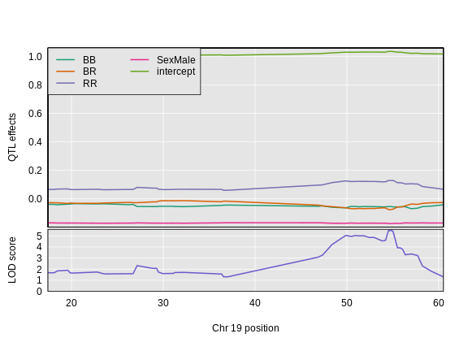
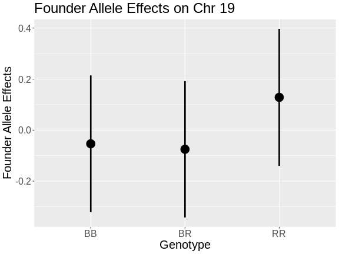

:::::::::::::::::::::::::::::::::::::: questions 

- How do I find the founder allele effects at a QTL peak?

::::::::::::::::::::::::::::::::::::::::::::::::

::::::::::::::::::::::::::::::::::::: objectives

- Estimate the founder allele effects at a QTL peak.
- Plot the estimated founder allele effects.

::::::::::::::::::::::::::::::::::::::::::::::::


## Estimating Founder Allele Effects

<!-- DMG: Sue, can you make the equations Latex and remake the figures
with the BTBR data? -->

Recall that to model data from a cross, we use

$y_j = \mu + \beta_k G_{jk} + \epsilon_j$

where $y_{ij}$ is the phenotype of the $j$th individual, $\mu$ is the mean 
phenotype value, $\beta_k$ is the effect of the $k$th genotype, $G_{jk}$ is the 
genotype for individual $j$, and $\epsilon_j$ is the error for the $j$th 
individual. In the figure below, $\mu$ equals 1, 
and $\beta$ equals 0.1 for the alternative 
hypothesis (QTL exists).


This linear model is <i>y</i> = 1 + 
0.1X + &epsilon;. The model intersects the 
genotype groups at their group means, and is based on &mu; and 
<i>&beta;<sub>k</sub></i> for chromosome 2 marker rs13476803 located at 
138.944754 Mb.  

The effect of genotype RR (the &beta; for the 
RR genotype) at marker rs13476803 is 
0.1, while the effect of the 
BB genotype is -0.1 on 
the insulin phenotype. The effect of the BR genotype 
is 0 relative to $\mu$ equals 
1.

The `scan1()` function returns only LOD scores. To obtain estimated QTL effects,
use the function `scan1coef()`. This function takes a single phenotype and the 
genotype probabilities for a single chromosome and returns a matrix with the 
estimated coefficients at each putative QTL location along the chromosome.

For example, to get the estimated QTL effects on chromosome 2 for the insulin 
phenotype, we would provide the chromosome 2 genotype probabilities and the 
insulin phenotype to the function `scan1coef()` as follows:


``` r
chr      <- "7"
eff_chr7 <- scan1coef(genoprobs = probs[,chr], 
                      pheno     = cross$pheno[,"log10_insulin_10wk", drop = FALSE],
                      kinship   = kinship_loco[[chr]],
                      addcovar  = addcovar)
```


The result is a matrix of 109 positions $\times$  
4 genotypes. An additional column contains the intercept 
values ($\mu$).


``` r
dim(eff_chr7)
```

``` output
[1] 109   5
```

## Plotting Founder Allele Effects Along a Chromosome

To plot the QTL effects, use the `plot_coef()` function. Add the LOD plot to 
the `scan1_output` argument to include a LOD plot at the bottom.


``` r
plot_coef(x            = eff_chr7, 
          map          = cross$pmap,
          scan1_output = lod_add_loco, 
          legend       = "topright")
```



The plot shows effect values on the y-axis and cM values on the x-axis. The
value of the intercept (&mu;) appears at the top. The effect of the 
BR genotype is centered around zero, with the
effects of the other two genotypes above and below. We are usually not 
directly interested in how the additive covariates change across the genome, 
but rather, the the founder allele effects change.

To plot only the founder allele effects, use the argument `columns` to indicate
which coefficients to plot. Let's look at the columns which contain the founder 
allele effects.


``` r
head(eff_chr7)
```

``` output
                   BB           BR          RR    SexMale intercept
rs8252589  0.02792439 -0.002516938 -0.02540745 -0.1753913  1.011125
rs13479104 0.02140644  0.002728978 -0.02413541 -0.1751367  1.009704
rs13479112 0.02010520  0.006609288 -0.02671449 -0.1750756  1.008747
rs13479114 0.01880760  0.007656166 -0.02646377 -0.1750906  1.008527
rs13479120 0.02083594  0.005991180 -0.02682712 -0.1752293  1.008946
rs13479124 0.02061108  0.002498998 -0.02311008 -0.1751596  1.009863
```

We would like to plot the columns "BB", "BR", and "RR", which are in columns
1 through 3. This is what we pass into the `columns` argument.


``` r
plot_coef(x       = eff_chr7, 
          map     = cross$pmap, 
          columns = 1:3, 
          scan1_output = lod_add_loco, 
          main    = "Chromosome 2 QTL effects and LOD scores",
          legend  = "topleft")
```


Looking at the plot above, which founder allele contributes to higher 
insulin levels?

## Estimating Founder Allele Effects using BLUPs

Another option for estimating the founder allele effects is to treat them as 
[random effects](https://stats.stackexchange.com/questions/4700/what-is-the-difference-between-fixed-effect-random-effect-and-mixed-effect-mode#151800) 
and calculate 
[Best Linear Unbiased Predictors](https://en.wikipedia.org/wiki/Best_linear_unbiased_prediction) 
(BLUPs). This is particularly valuable for multi-parent populations such as the 
Collaborative Cross and Diversity Outbred mice, where the large number of 
possible genotypes at a QTL leads to considerable variability in the effect 
estimates. To calculate BLUPs, use `scan1blup()`; it takes the same arguments 
as `scan1coef()`, including the option of a kinship matrix to account for a 
residual polygenic effect.


``` r
blup_chr7 <- scan1blup(genoprobs = probs[,chr], 
                       pheno     = cross$pheno[,"log10_insulin_10wk", drop = FALSE],
                       kinship   = kinship_loco[[chr]],
                       addcovar  = addcovar)
```

We can plot the BLUP effects using `plot_coef` as before.


``` r
plot_coef(x       = blup_chr7, 
          map     = cross$pmap, 
          columns = 1:3, 
          scan1_output = lod_add_loco, 
          main    = paste("Chromosome", chr, "QTL BLUP effects and LOD scores"),
          legend  = "topleft")
```


In the plot below, we plotted the founder allele effects (solid lines) and the 
BLUPs (dashed lines). In this case, the effects are not greatly different, but 
the effects are "shrunken" toward zero. 


``` r
plot_coef(x       = eff_chr7, 
          map     = cross$pmap, 
          columns = 1:3, 
          main    = paste("Chromosome", chr,"QTL BLUP effects and LOD scores"),
          legend  = "topleft")
plot_coef(x       = blup_chr7, 
          map     = cross$pmap, 
          columns = 1:3,
          lty     = 2,
          legend  = "topleft",
          add     = TRUE)
```


## Plotting Allele Effects at one Marker

You may also want plot the founder allele effects at the marker with the
highest LOD. To do this, you first need to get the position of the marker from
the peak list.


``` r
peaks <- find_peaks(scan1_output = lod_add_loco,
                    map          = cross$pmap,
                    threshold    = thr)
peaks
```

``` output
  lodindex lodcolumn chr       pos      lod
1        1    pheno1   2 138.94475 7.127351
2        1    pheno1   7 144.18230 5.724018
3        1    pheno1  12  25.14494 4.310493
4        1    pheno1  14  22.24292 3.974322
5        1    pheno1  16  80.37433 4.114024
6        1    pheno1  19  54.83012 5.476587
```

The position of the maximum LOD on chromosome 7 is 144.182298
Mb. We can pass this value into the `qtl2` function `pull_genoprobpos` to get
the genoprobs at this marker.


``` r
max_pos <- subset(peaks, chr == '7')$pos
max_mkr <- find_marker(map = cross$pmap, 
                       chr = chr, 
                       pos = max_pos)

pr      <- pull_genoprobpos(genoprobs = probs, 
                            marker    = max_mkr)
```

<!-- DMG: Make this a challenge. -->

What does the structure of `pr` look like?


``` r
str(pr)
```

``` output
 num [1:490, 1:3] 1.55e-06 1.55e-06 1.55e-06 3.94e-05 1.00 ...
 - attr(*, "dimnames")=List of 2
  ..$ : chr [1:490] "Mouse3051" "Mouse3551" "Mouse3430" "Mouse3476" ...
  ..$ : chr [1:3] "BB" "BR" "RR"
```

`pr` is a numeric matrix with 490 rows and 3 columns. The
rownames contain the mouse IDs and the column names contain the genotypes.

We can then pass `pr` as an argument into the `fit1` function, which fits
the mapping model at a single marker.


``` r
mod = fit1(genoprobs = pr,
           pheno     = cross$pheno[,"log10_insulin_10wk", drop = FALSE],
           kinship   = kinship_loco[[chr]], 
           addcovar  = addcovar)
```

Then, we can plot the founder allele effects and their standard error.


``` r
mod_eff = data.frame(eff = mod$coef, 
                     se  = mod$SE) |>
           rownames_to_column("genotype") |>
           filter(genotype %in% c("BB", "BR", "RR"))

ggplot(data    = mod_eff, 
       mapping = aes(x = genotype, y = eff)) +
  geom_beeswarm() +
  geom_pointrange(mapping = aes(ymin = eff - se, 
                                ymax = eff + se),
                  size       = 1.5,
                  linewidth  = 1.25) +
  labs(title = paste("Founder Allele Effects on Chr", chr),
       x     = "Genotype", y = "Founder Allele Effects") +
  theme(text = element_text(size = 20))
```



In the plot above, which founder allele contributes to higher insulin levels?
Is that consistent with the plot created using `plot_coef` above?

If instead you want additive and dominance effects, you can provide a square 
matrix of _contrasts_, as follows:


``` r
c7effB <- scan1coef(genoprobs = probs[,chr], 
                    pheno     = cross$pheno[,"log10_insulin_10wk", drop = FALSE],
                    kinship   = kinship_loco[[chr]],
                    addcovar  = addcovar,
                    contrasts = cbind(mu = c(   1, 1,    1), 
                                      a  = c(  -1, 0,    1), 
                                      d  = c(-0.5, 1, -0.5)))
```

The result will then contain the estimates of `mu`, `a` (the additive effect), 
and `d` (the dominance effect). 


``` r
dim(c7effB)
```

``` output
[1] 109   4
```

``` r
head(c7effB)
```

``` output
                 mu           a            d    SexMale
rs8252589  1.011125 -0.02666592 -0.002516938 -0.1753913
rs13479104 1.009704 -0.02277092  0.002728978 -0.1751367
rs13479112 1.008747 -0.02340984  0.006609288 -0.1750756
rs13479114 1.008527 -0.02263568  0.007656166 -0.1750906
rs13479120 1.008946 -0.02383153  0.005991180 -0.1752293
rs13479124 1.009863 -0.02186058  0.002498998 -0.1751596
```

For marker rs13479570, `mu`, `a`, and `d` are 1.0058686, -0.1114157, -0.0201158, -0.164111.

Here's a plot of the chromosome 7 additive and dominance effects, which are in 
the second and third columns.


``` r
plot_coef(x       = c7effB, 
          map     = cross$pmap[chr], 
          columns = 2:3, 
          col     = 1:2)
legend('bottomleft', lty = 1, col = 1:2, legend = c("additive", "dominant"))
```


## Plotting Phenotypes versus Genotypes

Finally, to plot the raw phenotypes against the genotypes at a single putative
QTL position, you can use the function `plot_pxg()`. This takes a vector of 
genotypes as produced by the `maxmarg()` function, which picks the most likely
genotype from a set of genotype probabilities, provided it is greater than some
specified value (the argument `minprob`). Note that the “marg” in “maxmarg” 
stands for “marginal”, as this function is selecting the genotype at each
position that has maximum marginal probability.

<!-- DMG: Change this to Chr 7 -->

For example, we could get inferred genotypes at the chr 7 QTL for the insulin 
phenotype (at 28.6 cM) as follows:


``` r
g <- maxmarg(probs = probs, 
             map   = cross$pmap, 
             chr   = chr, 
             pos   = max_pos, 
             return_char = TRUE)
```

We use `return_char = TRUE` to have `maxmarg()` return a vector of character 
strings with the genotype labels.

We then plot the insulin phenotype against these genotypes as follows:


``` r
plot_pxg(geno   = g, 
         pheno  = cross$pheno[,"log10_insulin_10wk"], 
         SEmult = 2,
         main   = paste("Insulin vs Chr", chr ,"Genotype"))
```


::::::::::::::::::::::::::::::::::::: challenge 

## Challenge 1

Calculate the insulin BLUP effects for chromosome 7.  
1) Create an object called `blup_chr7` to contain the effects.  
2) Plot the chromosome 7 BLUPs and add the LOD plot at bottom.
3) Which founder allele increases insulin levels?

:::::::::::::::::::::::: solution 


``` r
chr <- '7'
blup_chr7 <- scan1blup(genoprobs = probs[,chr], 
                       pheno     = cross$pheno[,"log10_insulin_10wk"],
                       addcovar  = addcovar,
                       kinship   = kinship_loco[[chr]])  
plot_coef(x       = blup_chr7, 
          map     = cross$pmap,
          columns = 1:3,
          scan1_output = lod_add_loco,
          legend  = "topleft",
          main    = "Insulin")
```


The C57BL/6J allele on chromosome 7 increases insulin levels.

:::::::::::::::::::::::::::::::::

## Challenge 2

Calculate the insulin BLUP effects for chromosome 19.  
1.  Create an object called `blup_chr19` to contain the effects.  
2. Plot the chromosome 19 BLUPs and add the LOD plot at bottom.
3. Which founder allele increases insulin levels?
4. Plot insulin versus the genotype at the marker with the higest LOD on 
chromosome 19.

:::::::::::::::::::::::: solution 


``` r
chr <- '19'
blup_chr19 <- scan1blup(genoprobs = probs[, chr], 
                        pheno     = cross$pheno[, "log10_insulin_10wk"],
                        addcovar  = addcovar,
                        kinship   = kinship_loco[[chr]])  
plot_coef(x       = blup_chr19, 
          map     = cross$pmap,
          columns = 1:3,
          scan1_output = lod_add_loco,
          legend  = "topleft",
          main    = "Insulin")
```


The BTBR allele on chromosome 19 increases insulin levels.


``` r
max_pos19 = peaks$pos[peaks$chr == chr]
g <- maxmarg(probs = probs, 
             map   = cross$pmap, 
             chr   = chr, 
             pos   = max_pos19, 
             return_char = TRUE)

plot_pxg(geno   = g, 
         pheno  = cross$pheno[,"log10_insulin_10wk"], 
         SEmult = 2, 
         main   = "Insulin vs Chr 19 Genotype")
```


:::::::::::::::::::::::::::::::::
::::::::::::::::::::::::::::::::::::::::::::::::

::::::::::::::::::::::::::::::::::::: keypoints 

- "Estimated founder allele effects can be plotted from the mapping model coefficients."
- "Additive and dominance effects can be plotted using contrasts." 

::::::::::::::::::::::::::::::::::::::::::::::::
