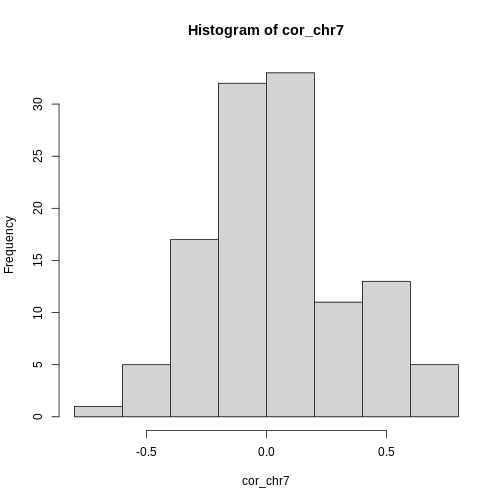
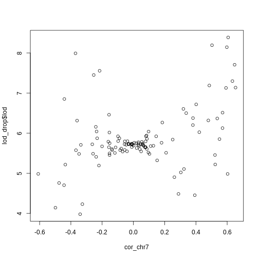

:::::::::::::::::::::::::::::::::::::: questions 

- How can I use gene expression data to identify candidate genes?
- What is expression QTL mapping?

::::::::::::::::::::::::::::::::::::::::::::::::

::::::::::::::::::::::::::::::::::::: objectives

- Find genes which are correlated with a physiological phenotype.
- Find genes which have expression QTL in the same position as a physiological 
phenotype.

::::::::::::::::::::::::::::::::::::::::::::::::


## Introduction

Once you have QTL peak, the next step if often to identify genes which may be 
causal candidates. However, there are often hundreds of genes within the QTL
support interval. How do you select candidate genes?

Often, there is a tissue which is related to the phenotype that you are
measuring. For example, if you measure circulating cardiac troponin, then gene
expression in the heart may be relevant. For some complex phenotypes, it may
not be easy to select a tissue. For example, if the liver creates a metabolite
that causes kidney injury, which is then exacerbated by the immune system, 
in which tissue would you measure gene expression?

Susceptibility to type 2 diabetes involves a complex interaction between
several tissues. However, for the purposes of this tutorial in which we mapped
circulating insulin levels, it is reasonable to look at gene expression in the 
pancreas.

## Reading in Gene Expression Data

Gene expression data consists of two parts: expression measurements and gene
annotation. In this study, gene expression was measured via two-color 
microarray. The expression values represent a ratio of two sets of RNA: a 
control set and the sample set. The expression values represent the 
log-normalized ratio of these two sets.

We have prepared two files containing normalized gene expression data and the 
gene annotation.


``` r
Sys.getenv("VROOM_CONNECTION_SIZE")
```

``` output
[1] ""
```


``` r
annot <- read_csv("data/attie_b6btbr_grcm39/attie_gene_annot.csv",
                  show_col_types = FALSE) |>
           mutate(a_gene_id = as.character(a_gene_id))

expr  <- read_csv("data/attie_b6btbr_grcm39/attie_gene_expr.csv",
                  show_col_types = FALSE)
```

::::::::::::::::::::::::::::::::::::: challenge 

## Challenge 1: Size of data structures.

1. How many rows and columns are in `annot`?
2. What are the column names off `annot`?

:::::::::::::::::::::::: solution 

Dimensions of `annot`.


``` r
dim(annot)
```

``` output
[1] 29860    13
```

Column names of `annot`.


``` r
colnames(annot)
```

``` output
 [1] "a_gene_id"       "chr"             "start"           "end"            
 [5] "width"           "strand"          "gene_id"         "gene_name"      
 [9] "gene_biotype"    "description"     "gene_id_version" "symbol"         
[13] "entrezid"       
```

:::::::::::::::::::::::::::::::::

## Challenge 2

1. What are the dimensions of `expr`?
2. Look at the top 5 row by 5 column block of `expr`.

:::::::::::::::::::::::: solution

1. Dimensions of `expr`.


``` r
dim(expr)
```

``` output
[1]   490 29861
```

2. Top-left block of `expr`.


``` r
expr[1:5,1:5]
```

``` output
# A tibble: 5 × 5
  MouseNum  `497628` `497629` `497630` `497632`
  <chr>        <dbl>    <dbl>    <dbl>    <dbl>
1 Mouse3051  -0.0790 -0.0114  -0.0790    0.0461
2 Mouse3551   0.0544 -0.0693  -0.0721   -0.408 
3 Mouse3430   0.154  -0.0468  -0.00900  -0.298 
4 Mouse3476   0.144  -0.0451  -0.00505   0.12  
5 Mouse3414   0.266   0.00496 -0.0746   -0.127 
```

:::::::::::::::::::::::::::::::::
::::::::::::::::::::::::::::::::::::::::::::::::

Let's look at the relationship between the annotation and the expression data.

The annotation data has 29860 rows and the expression data has
29861 columns. The first column in `expr` contains the mouse ID and
the remaining columns contain the expression values for each gene. The gene
IDs are in the column names. These are Agilent gene IDs. They are also in the
`a_gene_id` column in the annotation.


``` r
all(annot$a_gene_id == colnames(expr)[-1])
```

``` output
[1] TRUE
```

Now we know that the genes are aligned between the annotation and the 
expression data. When you receive your own expression data, it is critical 
that you align the genes in your expression data with your annotation data.

We must also align the mouse IDs between the physiological phenotypes and the
expression data. We saw above that the mouse IDs are in the first column of
the expression data. Let's see where the mouse IDs are in the phenotype data.


``` r
head(cross$pheno)
```

``` output
          log10_insulin_10wk agouti_tan tufted
Mouse3051          1.3985133          1      0
Mouse3551          0.3693926          1      1
Mouse3430          0.8599836          0      1
Mouse3476          0.7997233          1      0
Mouse3414          1.3702541          0      0
Mouse3145          1.7827215          1      0
```

`cross$pheno` is a matrix which contains the mouse IDs in the rownames. Let's convert
the expression data to a matrix as well.


``` r
expr <- expr |>
         column_to_rownames(var = "MouseNum") |>
         as.matrix()
```

Now let's check whether the mouse IDs are aligned between `cross$pheno` and 
`expr`. Again, when you assemble your phenotype and expression data, you will
need to make sure that the sample IDs are aligned between the data sets.


``` r
all(rownames(cross$pheno) == rownames(expr))
```

``` output
[1] TRUE
```

## Identifying Genes in a QTL Support Interval

In previous episodes, we found significant QTL peaks using the `find_peaks`
function. Let's look at those peaks again.


``` r
peaks
```

``` output
  lodindex lodcolumn chr       pos      lod      ci_lo     ci_hi
1        1    pheno1   2 138.94475 7.127351  64.949395 149.57739
2        1    pheno1   7 144.18230 5.724018 139.368290 144.18230
3        1    pheno1  12  25.14494 4.310493  15.834815  29.05053
4        1    pheno1  14  22.24292 3.974322   6.241951  45.93876
5        1    pheno1  16  80.37433 4.114024  10.238134  80.37433
6        1    pheno1  19  54.83012 5.476587  48.370980  55.15007
```

We looked at the QTL peak on chromosome 7 in a previous lesson. The QTL interval
is 4.814008 Mb wide.
This is quite wide. Let's get the genes expressed in the pancreas within this
region. 


``` r
chr <- '7'
peaks_chr7 <- filter(peaks, chr == '7')
annot_chr7 <- filter(annot, chr == '7' & start > peaks_chr7$ci_lo & end < peaks_chr7$ci_hi)
expr_chr7  <- expr[,annot_chr7$a_gene_id]
```

There are 117 genes! How can we start to narrow down which 
ones may be candidate genes?

::::::::::::::::::::::::::::::::::::: challenge 

## Challenge 1: How can we narrow down the candidate gene list?

1. Take a moment to think of ways that you could narrow down the gene list to
select the most promising candidate genes that regulate insulin levels.
2. Turn to your neighbor and exchange your ideas.
3. Share your ideas with the group.

:::::::::::::::::::::::: solution 

<!-- DMG: Correlation, eQTL, annotation? -->

:::::::::::::::::::::::::::::::::
::::::::::::::::::::::::::::::::::::::::::::::::

## Using Expression QTL Mapping

One method to search for candidate genes is to look for genes with expression 
that is correlated with the phenotype. Genes which are correlated with the 
insulin levels may be correlated because they control insulin levels, respond
to insulin levels, or are correlated by chance. Genes which are strongly
correlated with insulin levels should have QTL peaks in similar positions.


``` r
cor_chr7 = cor(cross$pheno[,'log10_insulin_10wk'], expr_chr7, use = 'pairwise')
```


``` r
hist(cor_chr7, breaks = 20)
```




``` r
ids_chr7 <- colnames(cor_chr7)[abs(cor_chr7) > 0.5]
annot |>
  filter(a_gene_id %in% ids_chr7)
```

``` output
# A tibble: 15 × 13
   a_gene_id   chr   start   end  width strand gene_id    gene_name gene_biotype
   <chr>       <chr> <dbl> <dbl>  <dbl> <chr>  <chr>      <chr>     <chr>       
 1 500662      7      143.  143.  25490 -      ENSMUSG00… Trpm5     protein_cod…
 2 500987      7      143.  143.   1606 -      ENSMUSG00… Phlda2    protein_cod…
 3 501974      7      142.  142.   2603 +      ENSMUSG00… Tnni2     protein_cod…
 4 511402      7      141.  141.  31848 +      ENSMUSG00… Muc2      protein_cod…
 5 511562      7      140.  140.   1324 +      ENSMUSG00… Utf1      protein_cod…
 6 10002172333 7      142.  142.    785 -      ENSMUSG00… Krtap5-1  protein_cod…
 7 10002902680 7      142.  142.  64726 -      ENSMUSG00… Ins2      protein_cod…
 8 10002908240 7      141.  141.   2226 -      ENSMUSG00… Ifitm6    protein_cod…
 9 10002909031 7      141.  141.  24141 +      ENSMUSG00… Eps8l2    protein_cod…
10 10002913589 7      140.  140.   1223 +      ENSMUSG00… Scgb1c1   protein_cod…
11 10004033038 7      143.  143. 320681 +      ENSMUSG00… Kcnq1     protein_cod…
12 10004033274 7      143.  143.  14856 -      ENSMUSG00… Tnfrsf22  protein_cod…
13 10004034230 7      141.  141.   1334 -      ENSMUSG00… Ifitm5    protein_cod…
14 10004034537 7      143.  143.   3284 -      ENSMUSG00… Mrgprg    protein_cod…
15 10004034772 7      143.  143. 320681 +      ENSMUSG00… Kcnq1     protein_cod…
# ℹ 4 more variables: description <chr>, gene_id_version <chr>, symbol <chr>,
#   entrezid <lgl>
```

Mediation.


``` r
# Get the probs at the maximum insulin QTL on Chr 7.
pr_chr7 = pull_genoprobpos(genoprobs = probs,
                           map       = cross$pmap,
                           chr       = chr,
                           pos       = peaks_chr7$pos)

# Create data sructure for results.
lod_drop = data.frame(a_gene_id = colnames(expr_chr7),
                      lod       = 0)

for(i in 1:ncol(expr_chr7)) {

  # Make new covariates.
  curr_covar = cbind(addcovar, expr_chr7[,i])
  
  mod = fit1(genoprobs = pr_chr7,
             pheno     = cross$pheno[,'log10_insulin_10wk',drop = FALSE],
             kinship   = kinship_loco[[chr]],
             addcovar  = curr_covar)
  
  lod_drop$lod[i] = mod$lod
  
} # for(i)
```


``` r
lod_drop <- left_join(lod_drop, annot_chr7, by = 'a_gene_id')
plot(lod_drop$start, lod_drop$lod)
abline(v = peaks_chr7$pos, col = 2)
```


``` r
plot(cor_chr7, lod_drop$lod)
```




If you have 


:::::::::::::::::::::::::::::::::::::::::::::::::::::::::::::::::::: instructor

This takes about 2 minutes to run.

::::::::::::::::::::::::::::::::::::::::::::::::::::::::::::::::::::::::::::::::


``` r
eqtl_chr7 <- scan1(genoprobs = probs[,chr],
                   pheno     = expr_chr7,
                   kinship   = kinship_loco[[chr]],
                   addcovar  = addcovar)
```


``` r
eqtl_chr7 <- apply(eqtl_chr7, 2, max, simplify = TRUE)
eqtl_chr7 <- eqtl_chr7[eqtl_chr7 > thr[1]]
```


``` r
length(eqtl_chr7)
```

``` output
[1] 8
```

::::::::::::::::::::::::::::::::::::: keypoints 

- Use `.md` files for episodes when you want static content
- Use `.Rmd` files for episodes when you need to generate output
- Run `sandpaper::check_lesson()` to identify any issues with your lesson
- Run `sandpaper::build_lesson()` to preview your lesson locally

::::::::::::::::::::::::::::::::::::::::::::::::

[r-markdown]: https://rmarkdown.rstudio.com/
