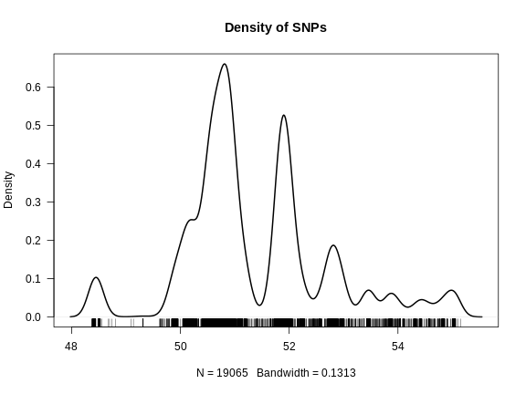
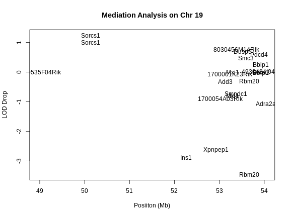

:::::::::::::::::::::::::::::::::::::: questions 

- How can I use gene expression data to identify candidate genes?
- What is expression QTL mapping?

::::::::::::::::::::::::::::::::::::::::::::::::

::::::::::::::::::::::::::::::::::::: objectives

- Find genes which are correlated with a physiological phenotype.
- Find genes which have expression QTL in the same position as a physiological 
phenotype.

::::::::::::::::::::::::::::::::::::::::::::::::


## Introduction

Once you have QTL peak, the next step if often to identify genes which may be 
causal candidates. However, there are often hundreds of genes within the QTL
support interval. How do you select candidate genes?

Often, there is a tissue which is related to the phenotype that you are
measuring. For example, if you measure circulating cardiac troponin, then gene
expression in the heart may be relevant. For some complex phenotypes, it may
not be easy to select a tissue. For example, if the liver creates a metabolite
that causes kidney injury, which is then exacerbated by the immune system, 
in which tissue would you measure gene expression?

Susceptibility to type 2 diabetes involves a complex interaction between
several tissues. However, for the purposes of this tutorial in which we mapped
circulating insulin levels, it is reasonable to look at gene expression in the 
pancreas.

## Reading in Gene Expression Data

Gene expression data consists of two parts: expression measurements and gene
annotation. In this study, gene expression was measured via two-color 
microarray. The expression values represent a ratio of two sets of RNA: a 
control set and the sample set. The expression values represent the 
log-normalized ratio of these two sets.

We have prepared two files containing normalized gene expression data and the 
gene annotation.


``` r
annot <- read_csv("data/attie_b6btbr_grcm39/attie_gene_annot.csv",
                  show_col_types = FALSE) |>
           mutate(a_gene_id = as.character(a_gene_id))

expr  <- read_csv("data/attie_b6btbr_grcm39/attie_gene_expr.csv",
                  show_col_types = FALSE)
```

::::::::::::::::::::::::::::::::::::: challenge 

## Challenge 1: Size of data structures.

1. How many rows and columns are in `annot`?
2. What are the column names off `annot`?

:::::::::::::::::::::::: solution 

Dimensions of `annot`.


``` r
dim(annot)
```

``` output
[1] 29860    13
```

Column names of `annot`.


``` r
colnames(annot)
```

``` output
 [1] "a_gene_id"       "chr"             "start"           "end"            
 [5] "width"           "strand"          "gene_id"         "gene_name"      
 [9] "gene_biotype"    "description"     "gene_id_version" "symbol"         
[13] "entrezid"       
```

:::::::::::::::::::::::::::::::::

## Challenge 2

1. What are the dimensions of `expr`?
2. Look at the top 5 row by 5 column block of `expr`.

:::::::::::::::::::::::: solution

1. Dimensions of `expr`.


``` r
dim(expr)
```

``` output
[1]   490 29861
```

2. Top-left block of `expr`.


``` r
expr[1:5,1:5]
```

``` output
# A tibble: 5 × 5
  MouseNum  `497628` `497629` `497630` `497632`
  <chr>        <dbl>    <dbl>    <dbl>    <dbl>
1 Mouse3051  -0.0790 -0.0114  -0.0790    0.0461
2 Mouse3551   0.0544 -0.0693  -0.0721   -0.408 
3 Mouse3430   0.154  -0.0468  -0.00900  -0.298 
4 Mouse3476   0.144  -0.0451  -0.00505   0.12  
5 Mouse3414   0.266   0.00496 -0.0746   -0.127 
```

:::::::::::::::::::::::::::::::::
::::::::::::::::::::::::::::::::::::::::::::::::

Let's look at the relationship between the annotation and the expression data.

The annotation data has 29860 rows and the expression data has
29861 columns. The first column in `expr` contains the mouse ID and
the remaining columns contain the expression values for each gene. The gene
IDs are in the column names. These are Agilent gene IDs. They are also in the
`a_gene_id` column in the annotation.


``` r
all(annot$a_gene_id == colnames(expr)[-1])
```

``` output
[1] TRUE
```

Now we know that the genes are aligned between the annotation and the 
expression data. When you receive your own expression data, it is critical 
that you align the genes in your expression data with your annotation data.

We must also align the mouse IDs between the physiological phenotypes and the
expression data. We saw above that the mouse IDs are in the first column of
the expression data. Let's see where the mouse IDs are in the phenotype data.


``` r
head(cross$pheno)
```

``` output
          log10_insulin_10wk agouti_tan tufted
Mouse3051              1.399          1      0
Mouse3551              0.369          1      1
Mouse3430              0.860          0      1
Mouse3476              0.800          1      0
Mouse3414              1.370          0      0
Mouse3145              1.783          1      0
```

`cross$pheno` is a matrix which contains the mouse IDs in the rownames. Let's convert
the expression data to a matrix as well.


``` r
expr <- expr |>
         column_to_rownames(var = "MouseNum") |>
         as.matrix()
```

Now let's check whether the mouse IDs are aligned between `cross$pheno` and 
`expr`. Again, when you assemble your phenotype and expression data, you will
need to make sure that the sample IDs are aligned between the data sets.


``` r
all(rownames(cross$pheno) == rownames(expr))
```

``` output
[1] TRUE
```

## Identifying Genes in a QTL Support Interval

In previous episodes, we found significant QTL peaks using the `find_peaks`
function. Let's look at those peaks again.


``` r
peaks
```

``` output
  lodindex          lodcolumn chr   pos  lod  ci_lo ci_hi
1        1 log10_insulin_10wk   2 138.9 7.13  64.95 149.6
2        1 log10_insulin_10wk   7 144.2 5.72 139.37 144.2
3        1 log10_insulin_10wk  12  25.1 4.31  15.83  29.1
4        1 log10_insulin_10wk  14  22.2 3.97   6.24  45.9
5        1 log10_insulin_10wk  16  80.4 4.11  10.24  80.4
6        1 log10_insulin_10wk  19  54.8 5.48  48.37  55.2
```

We looked at the QTL peak on chromosome 19 in a previous lesson. The QTL interval
is 6.779 Mb wide.
This is quite wide. Let's get the genes expressed in the pancreas within this
region. 


``` r
chr         <- '19'
peaks_chr19 <- filter(peaks, chr == '19')
annot_chr19 <- filter(annot, chr == '19' & start > peaks_chr19$ci_lo & end < peaks_chr19$ci_hi)
expr_chr19  <- expr[,annot_chr19$a_gene_id]
```

There are 22 genes! How can we start to narrow down which 
ones may be candidate genes?

::::::::::::::::::::::::::::::::::::: challenge 

## Challenge 3: How can we narrow down the candidate gene list?

1. Take a moment to think of ways that you could narrow down the gene list to
select the most promising candidate genes that regulate insulin levels.
2. Turn to your neighbor and exchange your ideas.
3. Share your ideas with the group.

:::::::::::::::::::::::: solution 

<!-- DMG: Correlation, eQTL, annotation? -->

:::::::::::::::::::::::::::::::::
::::::::::::::::::::::::::::::::::::::::::::::::

## Identifying Coding SNPs in QTL Intervals

When you have a QTL peak, you can search for SNPs which lie within the coding
regions of genes. These SNPs may cause amino acid substitutions which will
affect protein structure. The most comprehensive SNP resource is the
[Mouse Genomes Project](https://www.sanger.ac.uk/data/mouse-genomes-project/).
They have sequenced 52 inbred strains, including BTBR, and have made the data
available in 
[Variant Call Format](https://samtools.github.io/hts-specs/VCFv4.2.pdf) (VCF). 
The full VCF files are available on the 
[EBI FTP site](https://ftp.ebi.ac.uk/pub/databases/mousegenomes/REL-2112-v8-SNPs_Indels/).
However, the full SNP file is 22 GB! When you need other strains, you can 
download and query that file. However, for this workshop, we only need SNPs for
the BTBR strain. We have created a VCF file containing only SNPs which 
differ from C57BL/6J and BTBR. Let's read in this file now using the 
[VariantAnnotation](https://bioconductor.org/packages/release/bioc/html/VariantAnnotation.html) 
function [readVcf](https://rdrr.io/bioc/VariantAnnotation/man/readVcf-methods.html).


``` r
vcf <- readVcf(file.path("data", "btbr_snps_grcm39.vcf.gz"))
```

The `vcf` object contains both the SNP allele calls and information about the
sequencing depth and SNP consequences. Let's see how many SNPs are in the VCF.


``` r
dim(vcf)
```

``` output
[1] 4791000       1
```

There are about 4.8 million SNPs in `vcf`. There are many fields in the VCF
file and there are 
[vignettes](https://thejacksonlaboratory.box.com/shared/static/gwt3o0gh6pgaeyxuuym58zpur0ktvkz5.tbi)
which document the more advanced features. Here, we will search for SNPs within
QTL support intervals and filter them to retain missense or stop coding SNPs.

In order to filter the SNPs by location, we need to create a 
[GenomicRanges](https://www.bioconductor.org/packages/release/bioc/html/GenomicRanges.html) 
object which contains the coordinates of the QTL support interval on chromosome 
19. Note that the support interval is reported by `qtl2` in Mb and the GRanges
object must be given bp positions, so we need to multiply these by 1e6.


``` r
chr19_gr <- GRanges(seqnames = peaks_chr19$chr, 
                    ranges   = IRanges(peaks_chr19$ci_lo * 1e6, peaks_chr19$ci_hi * 1e6))
chr19_gr
```

``` output
GRanges object with 1 range and 0 metadata columns:
      seqnames            ranges strand
         <Rle>         <IRanges>  <Rle>
  [1]       19 48370979-55150074      *
  -------
  seqinfo: 20 sequences from an unspecified genome; no seqlengths
```

Next, we will filter the `vcf` object to retain SNPs within the support interval.


``` r
vcf_chr19 <- subsetByOverlaps(vcf, ranges = chr19_gr)
```

Let's see how many SNPs there are.


``` r
dim(vcf_chr19)
```

``` output
[1] 19065     1
```

There are still 19,000 SNPs! But many of them may not be in coding regions or
may be synonymous. Next, we will search for SNPs that have missense or stop
coding changes. These are likely to have the most severe effects. Note that
synonymous SNPs and SNPs in the untranslated region of genes may affect RNA
folding, RNA stability, and translation. But it is more difficult to predict
those effects.

Let's plot the density of the SNPs to see where they fall. We would not expect
genes which lie in regions without variation between B6 and BTBR to be involved
in regulating insulin levels.


``` r
# Get the SNP positions.
pos = start(rowRanges(vcf_chr19)) / 1e6

plot(density(pos), las = 1, lwd = 2, main = "Density of SNPs")
rug(pos)
```



From the plot above, we can see that the density of SNPS between B6 and BTBR is
not uniform. Most of the SNPs lie between 50 and 52 Mb, with less dense 
regions extending past 54 Mb.

The `vcf` object contains predicted SNP consequences in a field called `CSQ`.
The format of this field is challenging to parse, so we will get it, search
for missense and stop SNPs, and then do some data-wrangling to may the output
readable.


``` r
csq <- info(vcf_chr19)$CSQ
csq <- as.list(csq)

wh  <- grep('missense|stop', csq)
csq <- csq[wh]
rr  <- rowRanges(vcf_chr19)[wh]
```

Let's see how many SNPs had missense or stop codon consequences.


``` r
length(csq)
```

``` output
[1] 8
```

There were only 8 SNPs out of 19,000 SNPs with missense or stop 
codon consequences. Next, let's do the data wrangling to reformat the
consequences of these SNPs.

::::::::::::::::::::::::::::::::::::::::::::: instructor

This may be a good code chunk to have the students copy and paste.

::::::::::::::::::::::::::::::::::::::::::::::::::::::::


``` r
csq <- lapply(csq, strsplit, split = "\\|")
csq <- lapply(csq, function(z) {
                     matrix(unlist(z), ncol = length(z[[1]]), byrow = TRUE)
                   })

for(i in seq_along(csq)) {
  
  csq[[i]] <- data.frame(snp_id = names(rr)[i],
                         csq[[i]])
  
} # for(i)

csq = do.call(rbind, csq)
```

Let's look at the top of `csq`.


``` r
head(csq)
```

``` output
           snp_id X1               X2       X3     X4                 X5
1 19:50141282_A/G  G   intron_variant MODIFIER Sorcs1 ENSMUSG00000043531
2 19:50141282_A/G  T   intron_variant MODIFIER Sorcs1 ENSMUSG00000043531
3 19:50141282_A/G  C   intron_variant MODIFIER Sorcs1 ENSMUSG00000043531
4 19:50141282_A/G  G missense_variant MODERATE Sorcs1 ENSMUSG00000043531
5 19:50141282_A/G  T missense_variant MODERATE Sorcs1 ENSMUSG00000043531
6 19:50141282_A/G  C missense_variant MODERATE Sorcs1 ENSMUSG00000043531
          X6                 X7             X8    X9   X10 X11 X12  X13  X14
1 Transcript ENSMUST00000072685 protein_coding       26/26                  
2 Transcript ENSMUST00000072685 protein_coding       26/26                  
3 Transcript ENSMUST00000072685 protein_coding       26/26                  
4 Transcript ENSMUST00000111756 protein_coding 27/27               3465 3448
5 Transcript ENSMUST00000111756 protein_coding 27/27               3465 3448
6 Transcript ENSMUST00000111756 protein_coding 27/27               3465 3448
   X15 X16     X17 X18 X19 X20 X21 X22 X23 X24               X25 X26 X27 X28
1                           -1     SNV MGI                                  
2                           -1     SNV MGI                                  
3                           -1     SNV MGI                                  
4 1150 S/P Tct/Cct          -1     SNV MGI       tolerated(0.09)            
5 1150 S/T Tct/Act          -1     SNV MGI       tolerated(0.26)            
6 1150 S/A Tct/Gct          -1     SNV MGI     deleterious(0.03)            
  X29
1    
2    
3    
4    
5    
6    
```

There are a lot of columns and we may not need all of them. Next, let's reduce
the number of columns to keep the ones that we need.


``` r
csq <- csq[,c(1:7,9,17,18,26)]
```

Next, we will subset the consequences to retain the unique rows and then retain
rows which contain "missense" and "stop".


``` r
csq <- distinct(csq) |>
         filter(str_detect(X2, "missense|stop"))
```

Let's look at the top of `csq` now.


``` r
head(csq)
```

``` output
           snp_id X1               X2       X3     X4                 X5
1 19:50141282_A/G  G missense_variant MODERATE Sorcs1 ENSMUSG00000043531
2 19:50141282_A/G  T missense_variant MODERATE Sorcs1 ENSMUSG00000043531
3 19:50141282_A/G  C missense_variant MODERATE Sorcs1 ENSMUSG00000043531
4 19:50141444_G/A  A missense_variant MODERATE Sorcs1 ENSMUSG00000043531
5 19:50141444_G/A  T missense_variant MODERATE Sorcs1 ENSMUSG00000043531
6 19:50141444_G/A  C missense_variant MODERATE Sorcs1 ENSMUSG00000043531
          X6             X8 X16     X17                              X25
1 Transcript protein_coding S/P Tct/Cct                  tolerated(0.09)
2 Transcript protein_coding S/T Tct/Act                  tolerated(0.26)
3 Transcript protein_coding S/A Tct/Gct                deleterious(0.03)
4 Transcript protein_coding S/F tCc/tTc deleterious_low_confidence(0.01)
5 Transcript protein_coding S/Y tCc/tAc deleterious_low_confidence(0.01)
6 Transcript protein_coding S/C tCc/tGc deleterious_low_confidence(0.01)
```

Column `X4` contains gene names. Let's get the unique gene names.


``` r
csq |>
  distinct(X4)
```

``` output
      X4
1 Sorcs1
2  Rbm20
```

There are only two genes in the QTL support interval which contain missense
SNPs. 

::::::::::::::::::::::::::::::::::::: challenge 

## Challenge 4: Search Genes using Pubmed

1. Go to Pubmed and search for papers involving the two genes and insulin or
diabetes.

:::::::::::::::::::::::: solution 

Both genes return published papers relating to insulin:

[Sorcs1](https://pubmed.ncbi.nlm.nih.gov/?term=Sorcs1+insulin)

[Rbm2](https://pubmed.ncbi.nlm.nih.gov/?term=rbm20+insulin)

[Sorcs1](https://pubmed.ncbi.nlm.nih.gov/16682971/) was identified as a gene 
which relates to obesity-induced type 2 diabetes by the same group that
provided this data set. In fact, it was identified in the same type of mouse
cross between C57BL/6J and BTBR.

:::::::::::::::::::::::::::::::::
::::::::::::::::::::::::::::::::::::::::::::::::

In this case, we used published SNPs data to identify two potential candidate
genes. If we had not found publications that had already associated these 
genes with diabetes, these would be genes that you would follow up on in the
lab.

## Using Expression QTL Mapping

Another method of searching for candidate genes is to look for genes which have
QTL peaks in the same location as the insulin QTL. Genes which have QTL that are
co-located with insulin QTL will also be strongly correlated with insulin
levels. These genes may be correlated with insulin because they control insulin 
levels, respond to insulin levels, or are correlated by chance. However, genes
which have QTL within the insulin QTL support interval are reasonable candidate
genes since we expect the genotype to influence expression levels.

Let's perform QTL mapping on the genes within the chromosome 19 insulin QTL
support interval. We can do this by passing in the expression values as 
phenotypes into `scan1`.


``` r
eqtl_chr19 <- scan1(genoprobs = probs[,chr],
                    pheno     = expr_chr19,
                    kinship   = kinship_loco[[chr]],
                    addcovar  = addcovar)
```

Let's look at the top of the results.


``` r
head(eqtl_chr19[,1:6])
```

``` output
           498370 500695 501344 504488 505754 506116
rs4232073    2.38   2.02  0.766  0.279  0.918 0.1567
rs13483548   2.34   2.01  0.778  0.279  0.919 0.1567
rs13483549   2.33   2.00  0.784  0.278  0.913 0.1489
rs13483550   2.23   1.72  0.865  0.245  0.765 0.0618
rs13483554   1.94   1.69  0.886  0.249  0.819 0.1127
rs13483555   2.08   1.62  0.862  0.255  0.867 0.1289
```

The eQTL results have one row for each marker and one column for each gene.
Each column represents the LOD plot for one gene. Let's plot the genome scan
for one gene.


``` r
gene_id <- '10002678668'
symbol  <- annot_chr19$gene_name[annot_chr19$a_gene_id == gene_id]

plot_scan1(x   = eqtl_chr19, 
           map = cross$pmap,
           lodcolumn = gene_id,
           main      = symbol)
```


This gene seems to have a QTL on chromosome 19 near 52 Mb with a LOD of 34. 
The insulin QTL is closer to 55 Mb, so this may be a good candidate gene. 

We can harvest the significant QTL peaks on chromosome 19 using `find_peaks`.
We will use the default threshold of LOD = 3.


``` r
eqtl_chr19_peaks <- find_peaks(eqtl_chr19, map = cross$pmap) |>
                      arrange(pos)
eqtl_chr19_peaks
```

``` output
  lodindex   lodcolumn chr  pos   lod
1       21 10004035475  19 47.4  4.66
2       17 10002936879  19 51.4  7.66
3       16 10002928587  19 51.8  7.12
4       11 10002678668  19 52.4 34.67
5        1      498370  19 53.0 12.39
6       14 10002910800  19 54.8  4.23
```

We can see that there are 6 significant QTL on 
chromosome 19. All of these genes are within the support interval of the insulin
QTL.

Let's filter the eQTL genes and add in gene annotation for them.


``` r
eqtl_chr19_peaks <- eqtl_chr19_peaks |>
                     filter(pos > peaks_chr19$ci_lo & pos < peaks_chr19$ci_hi) |>
                     left_join(annot, by = c('lodcolumn' = 'a_gene_id'))
eqtl_chr19_peaks
```

``` output
  lodindex   lodcolumn chr.x  pos   lod chr.y start  end  width strand
1       17 10002936879    19 51.4  7.66    19  53.7 53.9 189775      +
2       16 10002928587    19 51.8  7.12    19  50.1 50.7 535348      -
3       11 10002678668    19 52.4 34.67    19  52.9 53.0 108289      -
4        1      498370    19 53.0 12.39    19  53.4 53.4  11189      -
5       14 10002910800    19 54.8  4.23    19  52.3 52.3   1180      +
             gene_id gene_name   gene_biotype
1 ENSMUSG00000043639     Rbm20 protein_coding
2 ENSMUSG00000043531    Sorcs1 protein_coding
3 ENSMUSG00000025027   Xpnpep1 protein_coding
4 ENSMUSG00000025024    Smndc1 protein_coding
5 ENSMUSG00000035804      Ins1 protein_coding
                                                                                description
1                          RNA binding motif protein 20 [Source:MGI Symbol;Acc:MGI:1920963]
2   sortilin-related VPS10 domain containing receptor 1 [Source:MGI Symbol;Acc:MGI:1929666]
3 X-prolyl aminopeptidase (aminopeptidase P) 1, soluble [Source:MGI Symbol;Acc:MGI:2180003]
4             survival motor neuron domain containing 1 [Source:MGI Symbol;Acc:MGI:1923729]
5                                               insulin I [Source:MGI Symbol;Acc:MGI:96572]
        gene_id_version  symbol entrezid
1 ENSMUSG00000043639.16   Rbm20       NA
2 ENSMUSG00000043531.17  Sorcs1       NA
3 ENSMUSG00000025027.19 Xpnpep1       NA
4  ENSMUSG00000025024.8  Smndc1       NA
5  ENSMUSG00000035804.6    Ins1       NA
```

Let's plot the insulin QTL again to remind ourselves what the peak on chromosome
19 look like. We will also plot the genome scan for one of the genes on
chromosome 19.


``` r
gene_id <- "10002936879"
symbol  <- annot_chr19$gene_name[annot_chr19$a_gene_id == gene_id]

plot_scan1(x    = eqtl_chr19,
           map  = cross$pmap,
           lodcolumn = gene_id,
           main = "Insulin")
plot_scan1(x    = lod_add_loco, 
           map  = cross$pmap,
           chr  = '19',
           col  = 'blue',
           add  = TRUE)
legend("topleft", legend = c("insluin", symbol), 
       col = c('blue', 'black'), lwd = 2)
```


Why would we prioritize genes with an eQTL in the same location as an insulin
QTL? If a gene has an eQTL in the same location, there are genetic variants 
which influence it's expression at that location. These variants may be 
distinct from the ones which influence the phenotype or they may influence
gene expression which then influences the phenotype. We call this causal
relationship of a SNP changing expression, which then changes the phenotype,
"mediation". 

## Mediation Analysis

If a gene is correlated with insulin levels and if it has an eQTL in the same
location as insulin, then we could add it into the insulin QTL model and see if
it reduces the LOD on chromosome 19.


``` r
stopifnot(rownames(addcovar) == rownames(expr_chr19))
addcovar_chr19 <- cbind(addcovar, expr_chr19[,"10002936879"])

lod_med <- scan1(genoprobs = probs[,chr],
                 pheno     = insulin,
                 kinship   = kinship_loco[[chr]],
                 addcovar  = addcovar_chr19)
```

Next, we will plot the original insulin genome scan and overlay the genome scan
with gene `10002936879` in the model.


``` r
gene_id <- "10002936879"
symbol  <- annot_chr19$gene_name[annot_chr19$a_gene_id == gene_id]

plot_scan1(x    = lod_add_loco,
           map  = cross$pmap,
           chr  = '19',
           main = paste("Insulin with/without", symbol))
plot_scan1(x    = lod_med,
           map  = cross$pmap,
           chr  = '19',
           col  = "blue",
           add  = TRUE)
legend("topleft", legend = c("insluin", "mediation"), 
       col = c('black', 'blue'), lwd = 2)
```


The LOD dropped from 5.477 to 
2.02. This is a difference
of 3.456.

It would be slow to run a genome scan for each gene on chromosome 19 and look
at the LOD drop. Also, we don't really need the LOD drop across the entire 
chromosome. We only need the LOD drop at the location of the peak LOD. To do
this, we can use the `fit1` function to get the LOD at the marker with the
highest LOD in the insulin genome scan.


``` r
# Get the probs at the maximum insulin QTL on Chr 19.
pr_chr19 = pull_genoprobpos(genoprobs = probs,
                            map       = cross$pmap,
                            chr       = chr,
                            pos       = peaks_chr19$pos)

# Create data sructure for results.
lod_drop = data.frame(a_gene_id = colnames(expr_chr19),
                      lod       = 0)

for(i in 1:ncol(expr_chr19)) {

  # Make new covariates.
  curr_covar = cbind(addcovar, expr_chr19[,i])
  
  mod = fit1(genoprobs = pr_chr19,
             pheno     = insulin,
             kinship   = kinship_loco[[chr]],
             addcovar  = curr_covar)
  
  lod_drop$lod[i] = mod$lod
  
} # for(i)

lod_drop$lod_drop = lod_drop$lod - peaks_chr19$lod
```


``` r
lod_drop <- left_join(lod_drop, annot_chr19, by = 'a_gene_id')

plot(lod_drop$start, lod_drop$lod_drop, col = NA, 
     main = "Mediation Analysis on Chr 19",
     xlab = "Posiiton (Mb)", ylab = "LOD Drop")
text(lod_drop$start, lod_drop$lod_drop, labels = lod_drop$gene_name)
abline(v = peaks_chr19$pos, col = 2)
```



In the plot above, we plotted the position of each gene versus the decrease in
the LOD score (i.e. LOD drop). Genes with the lowest LOD drop are the best 
candidate genes based on mediation analysis.

Let's look at the annotation for the genes with LOD drop less than -2.


``` r
lod_drop |>
  filter(lod_drop < -2) |>
  select(gene_id, symbol, chr, start, end, lod, lod_drop, description)
```

``` output
             gene_id  symbol chr start  end  lod lod_drop
1 ENSMUSG00000025027 Xpnpep1  19  52.9 53.0 2.85    -2.63
2 ENSMUSG00000035804    Ins1  19  52.3 52.3 2.60    -2.88
3 ENSMUSG00000043639   Rbm20  19  53.7 53.9 2.02    -3.46
                                                                                description
1 X-prolyl aminopeptidase (aminopeptidase P) 1, soluble [Source:MGI Symbol;Acc:MGI:2180003]
2                                               insulin I [Source:MGI Symbol;Acc:MGI:96572]
3                          RNA binding motif protein 20 [Source:MGI Symbol;Acc:MGI:1920963]
```

Do you see any good candidate genes which might regulate insulin?

## Summary

In this episode, we learned how to identify candidate genes under a QTL peak.
In a perfect world, there would be exactly one gene implicated by these 
analyses. In most cases, you will have a set of candidate genes and you will
need to study each gene and prioritize some for laboratory follow-up. 

There are two ways of searching for candidate genes: using SNPs in the QTL
interval, and looking for genes with eQTL which are co-located with the 
phenotype QTL. We learned how to query a VCF file and how to perform mediation
analysis. After this step, you will have a set of genes which you can test
for association with your phenotype. 

::::::::::::::::::::::::::::::::::::: keypoints 

- There will be many genes under a QTL peak.
- You can search for genes with SNPs that produce coding changes by querying
a VCF file.
- You can search for genes with expression changes that may influence your
phenotype by performing mediation analysis with expression data from the same
mice.

::::::::::::::::::::::::::::::::::::::::::::::::

[r-markdown]: https://rmarkdown.rstudio.com/
