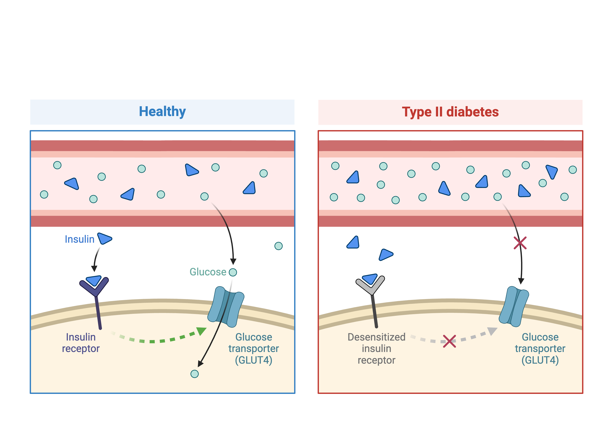
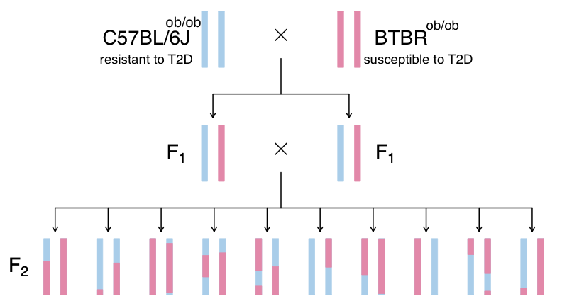

:::::::::::::::::::::::::::::::::::::: questions 

- What data will we be using in this workshop?

::::::::::::::::::::::::::::::::::::::::::::::::

::::::::::::::::::::::::::::::::::::: objectives

- Understand the experimental design of the data set.
- Understand the goals of the experiment. 

::::::::::::::::::::::::::::::::::::::::::::::::

## Introduction

In the first part of this lesson, we will be analyzing data from a mouse
experiment involving Type 2 diabetes (T2D). There are two types of diabetes:
type 1, in which the immune system attacks insulin-secreting cells and prevents
insulin production, and type 2, in which the pancreas makes less insulin and
the body becomes less responsive to insulin.

Created in  BioRender.com

This study is from 
[Tian et al](https://www.ncbi.nlm.nih.gov/pmc/articles/PMC4649649/)
and involves an intercross between the diabetes-resistant C57BL/6J (B6 or B) 
strain and the diabetes-susceptible BTBR T+ tf/J (BTBR or R) strain mice 
carrying a Leptin^ob/ob^ mutation. 

The <ob> mutation causes the mice to not produce 
[leptin](https://en.wikipedia.org/wiki/Leptin), a hormone that 
regulates hunger and satiety. When leptin levels are low (or missing), the body 
does not receive satiety signals and continues to feel hunger. Leptin^ob/ob^ 
mice continue to eat and become obese. Obesity is one of the risk factors for 
T2D and this experiment sought to use genetic variation between B6 and BTBR
strains to identify genes which influence T2D. 

This study measured insulin and glucose levels in mice at 10 weeks, at which
time the mice were euthanized. After euthanasia, the author's harvested six
tissues, adipose, gastrocnemius muscle, hypothalamus, pancreatic islets, kidney,
and liver, and measured transcript levels via gene expression microarray.

In this study, we will analyze circulating insulin levels and pancreatic islet 
gene expression. We will map circulating insulin levels to identify genomic
loci which influence insulin levels. We will then use the pancreatic islet
gene expression data to identify candidate genes.

::::::::::::::::::::::::::::::::::::: keypoints 

- Leptin^ob/ob^ mice do now produce insulin and become obese due to overeating.
- This study crossed mice carrying the Leptin^ob/ob^ mutation in C57BL/6J and
BTBR T+ tf/J.
- C57BL/6J mice are resistant to diabetes and BTBR mice are susceptible.
- By crossing these two strains, the authors aimed to identify genes which
influence susceptibility to T2D.

::::::::::::::::::::::::::::::::::::::::::::::::

[r-markdown]: https://rmarkdown.rstudio.com/
