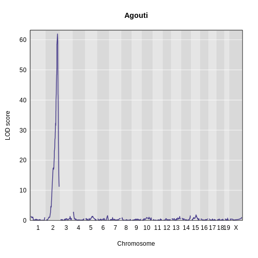

:::::::::::::::::::::::::::::::::::::: questions 

- "How do I perform a genome scan for binary traits?"

::::::::::::::::::::::::::::::::::::::::::::::::

::::::::::::::::::::::::::::::::::::: objectives

- Convert phenotypes to binary values.
- Use logistic regression for genome scans with binary traits.
- Plot and compare genome scans for binary traits.

::::::::::::::::::::::::::::::::::::::::::::::::


The genome scans in the previous episode were performed assuming that the 
residual variation followed a normal distribution. This will often provide 
reasonable results even if the residuals are not normal, but an important 
special case is that of a binary trait, with values 0 and 1, which is best 
treated differently. The `scan1` function can perform a genome scan with binary
traits by logistic regression, using the argument `model="binary"`. (The default
value for the `model` argument is `"normal"`) At present, we _can not_ account 
for kinship relationships among individuals in this analysis.

Let's look at the phenotypes in the cross again.


``` r
head(cross$pheno)
```

``` output
          log10_insulin_10wk agouti_tan tufted
Mouse3051              1.399          1      0
Mouse3551              0.369          1      1
Mouse3430              0.860          0      1
Mouse3476              0.800          1      0
Mouse3414              1.370          0      0
Mouse3145              1.783          1      0
```

There are two binary traits called "agouti_tan", and "tufted" which are related
to coat color and shape.

We perform a binary genome scan in a manner similar to mapping continuous traits
by using `scan1`. When we mapped insulin, there was a hidden argument called 
`model` which told `qtl2` which mapping model to use. There are two options:
`normal`, the default, and `binary`. The `normal` argument tells `qtl2` to use a
"normal" (least squares) linear model. To map a binary trait, we will 
include the `model = "binary"` argument to indicate that the phenotype is a 
binary trait with values 0 and 1.


``` r
lod_agouti <- scan1(genoprobs = probs, 
                    pheno     = cross$pheno[,'agouti_tan', drop = FALSE], 
                    addcovar  = addcovar, 
                    model     = "binary")
```

Let's plot the result and see if there is a peak.


``` r
plot_scan1(x    = lod_agouti, 
           map  = cross$pmap, 
           main = 'Agouti')
```



Yes! There is a big peak on chromosome 2. Let's zoom in on chromosome 2.


``` r
plot_scan1(x    = lod_agouti, 
           map  = cross$pmap, 
           chr  = "2",
           main = "Agout")
```


We can use `find_peaks` to find the position of the highest LOD score.


``` r
find_peaks(scan1_output = lod_agouti, 
           map          = cross$pmap)
```

This turns out to be a well-known coat color locus for agouti coat color which
contains the [nonagouti](https://www.informatics.jax.org/marker/MGI:87853) gene.
Mice carrying two black alleles will have a black coat, and mice carrying
one or no black alleles will have agouti coats.

::::::::::::::::::::::::::::::::::::: challenge

## Challenge 1: How many mice have black coats?

Look at the frequency of the black (0) and agouti (1) phenotypes. What 
proportion of the mice are black? Can you use what you learned about how
the `nonagouti` locus works and the cross design to explain the frequency of 
black mice?

::::::::::::::::::::::::::::::::: solution

First, get the number of black and agouti mice.


``` r
tbl <- table(cross$pheno[,"agouti_tan"])
tbl
```

``` output

  0   1 
125 356 
```

Then use the number of mice to calculate the proportion with each coat color.


``` r
tbl / sum(tbl)
```

``` output

   0    1 
0.26 0.74 
```

We can see that the black (0) mice occur about 25 % of the time. If the `B` 
allele causes mice to have black coats when it is recessive, and if `R` is the 
agouti allele, then, when breeding two heterozygous (`BR`) mice together, we
expect the following genotypes in the progeny:

     |  B   |  R
-----+------+------
  B  |  BB  |  BR
  R  |  BB  |  RR

Hence, we expect mean allele frequencies and coat colors as follows:

Allele | Frequency | Coat Color
-------+-----------+-----------
  BB   |    0.25   |   black
  BR   |    0.50   |   agouti
  RR   |    0.25   |   agouti

From this, we can see that about 25% of the mice should have black coats.

::::::::::::::::::::::::::::::::::::::::::

## Challenge 2: Map the "tufted" phenotype.

Map the tufted phenotype an determine if there are any tall peaks for this 
trait.

::::::::::::::::::::::::::::::::: solution

First, map the trait.


``` r
lod_tufted <- scan1(genoprobs = probs, 
                    pheno     = cross$pheno[,"tufted", drop = FALSE], 
                    addcovar  = addcovar, 
                    model     = "binary")
```

Then, plot the LOD score.


``` r
plot_scan1(x    = lod_tufted, 
           map  = cross$pmap, 
           main = "Tufted")
```


There is a large peak on chromosome 17. This is a 
[known locus](https://www.ncbi.nlm.nih.gov/pmc/articles/PMC3570182/) 
associated with the [Itpr3](https://www.informatics.jax.org/marker/MGI:96624)
gene near 27.3 Mb on chromsome 17.

::::::::::::::::::::::::::::::::::::::::::

:::::::::::::::::::::::::::::::::::::::::::::::


::::::::::::::::::::::::::::::::::::: keypoints 

- "A genome scan for binary traits (0 and 1) requires special handling; scans 
for non-binary traits assume normal variation of the residuals."
- "A genome scan for binary traits is performed using logistic regression."

::::::::::::::::::::::::::::::::::::::::::::::::
