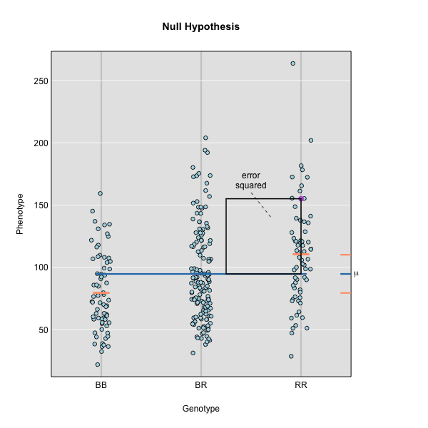
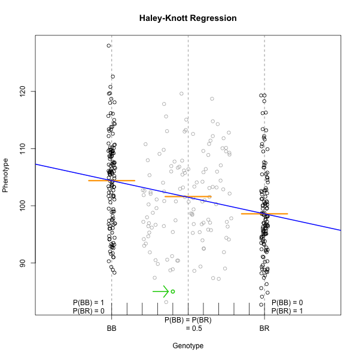
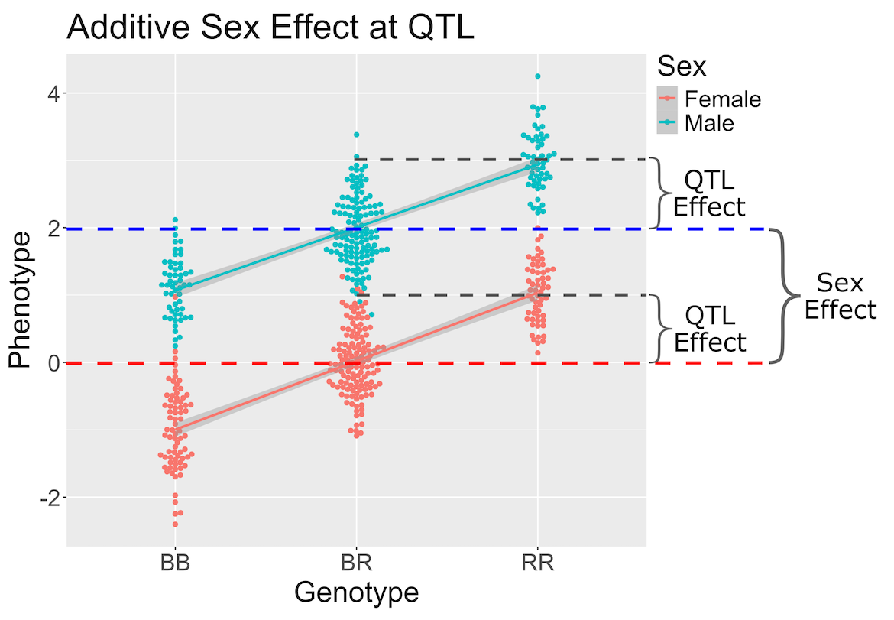
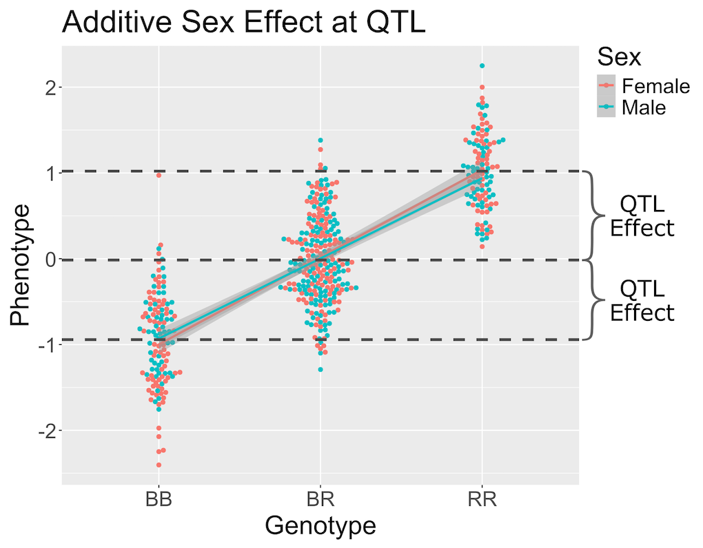
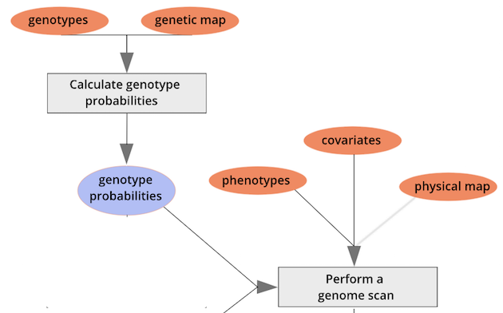
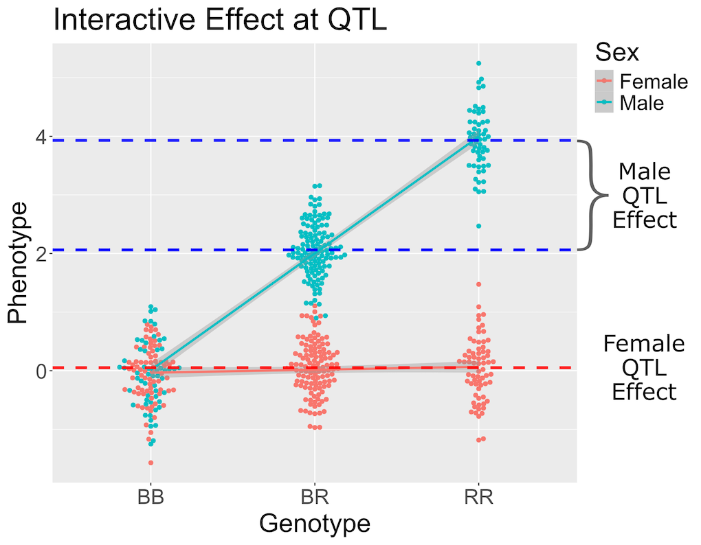

:::::::::::::::::::::::::::::::::::::: questions 

- How do I perform a genome scan?
- How do I plot a genome scan?
- How do additive covariates differ from interactive covariates?

::::::::::::::::::::::::::::::::::::::::::::::::

::::::::::::::::::::::::::::::::::::: objectives

- Map one trait using additive covariates.
- Map the sample trait using additive and interactive covariates.
- Plot a genome scan.

::::::::::::::::::::::::::::::::::::::::::::::::


The freely available chapter on 
[single-QTL analysis](https://www.rqtl.org/book/rqtlbook_ch04.pdf) 
from Broman and Sen's 
[A Guide to QTL Mapping with R/qtl](https://www.rqtl.org/book/) describes 
different methods for QTL analysis. We will present two of these methods here - 
marker regression and Haley-Knott regression. The chapter provides the 
statistical background behind these and other QTL mapping methods.  

Linear regression can be employed to identify presence of QTL in a cross. To 
identify QTL using regression, we compare the fit for two models: 1) the null 
hypothesis that there are no QTL anywhere in the genome; and 2) the alternative 
hypothesis that there is a QTL near a specific position. A sloped line indicates 
that there is a difference in mean phenotype between genotype groups, and that a 
QTL is present. A line with no slope indicates that there is no difference in 
mean phenotype between genotype groups, and that no QTL exists. Regression aims 
to find the line of best fit to the data. 

{alt="Null and alternative hypotheses"}

To find the line of best fit, the residuals or errors are calculated, then 
squared for each data point. A residual, also known as an error, is the distance
from the line to a data point.

{alt="Alternative hypothesis"}
{alt="Null hypothesis"}

The line of best fit will be the one that minimizes the sum of squared 
residuals, which maximizes the likelihood of the data. 

Marker regression produces a LOD (logarithm of odds) score comparing the null 
hypothesis to the alternative. The LOD score is calculated using the sum of 
squared residuals (RSS) for the null and alternative hypotheses. The LOD score 
is the difference between the log10 likelihood of the null hypothesis and the 
log10 likelihood of the alternative hypothesis. It is related to the regression model above by identifying the line of best fit to the data.  

LOD = $n/2 \times log10(RSS_0/RSS_1)$

A higher LOD score indicates greater likelihood of the alternative hypothesis. A LOD score closer to zero favors the null hypothesis. 

Marker regression can identify the existence and effect of a QTL by comparing 
means between groups, however, it requires known marker genotypes and can't 
identify QTL in between typed markers. To identify QTL between typed markers, we 
use Haley-Knott regression. After 
[calculating genotype probabilities](https://smcclatchy.github.io/qtl-mapping/calc-genoprob.html), 
we can regress the phenotypes for animals of unknown genotype on these 
conditional genotype probabilities (conditional on known marker genotypes). In 
Haley-Knott regression, phenotype values can be plotted and a regression line 
drawn through the phenotype mean for the untyped individuals.

{alt="Haley Knott regression"}

As shown by the green circle in the figure, an individual of unknown genotype is 
placed between known genotypes according to the probability of its genotype 
being BB or BR. In this case, the probability of this individual having genotype
BB is 0.6, and the probability of having genotype BR is 0.4.

To perform a genome scan by Haley-Knott regression
([Haley and Knott 1992](https://www.ncbi.nlm.nih.gov/pubmed/16718932)),
use the function `scan1()`.  `scan1()` takes as input the genotype 
probabilities, a matrix of phenotypes, and then optional additive and 
interactive covariates. Another option is to provide a vector of weights.

## Additive Genome Scan

There are two potential covariates in the Attie data set. Let's look at the
top of the covariates in the `cross` object.


``` r
head(cross$covar)
```

``` output
             Sex pgm adipose_batch gastroc_batch hypo_batch islet_batch
Mouse3051   Male   1    12/19/2007     8/11/2008 11/26/2007  11/28/2007
Mouse3551   Male   1    12/19/2007     8/12/2008 11/27/2007  12/03/2007
Mouse3430   Male   1    12/19/2007     8/12/2008 11/27/2007  12/03/2007
Mouse3476   Male   1    12/19/2007     8/12/2008 11/27/2007  12/03/2007
Mouse3414   Male   1    12/18/2007     8/11/2008 11/26/2007  11/28/2007
Mouse3145 Female   1    12/19/2007     8/11/2008         NA  11/28/2007
          kidney_batch liver_batch
Mouse3051   07/15/2008       other
Mouse3551   07/16/2008  12/10/2007
Mouse3430   07/15/2008  12/05/2007
Mouse3476   07/16/2008  12/05/2007
Mouse3414   07/15/2008  12/05/2007
Mouse3145   07/15/2008  12/10/2007
```

`Sex` is a potential covariate. It is a good idea to always include sex in any 
analysis. Even if you perform an ANOVA and think that sex is not important, it 
doesn't hurt to add in one extra degree of freedom to your model. Examples of 
other covariates might be age, diet, treatment, or experimental batch. It is 
worth taking time to identify covariates that may affect your results.

First, we will make sex a `factor`, which is the term that R uses for 
categorical variables. This is required for the next function to work correctly. 
Then we will use `model.matrix` to create a matrix of "dummy" variables which 
encode the sex of each mouse.


``` r
cross$covar$Sex <- factor(cross$covar$Sex)

addcovar <- model.matrix(~Sex, data = cross$covar)[,-1, drop = FALSE]
```


When we perform a genome scan with additive covariates, we are searching for 
loci that have the same effect in both covariate groups. In this case, we are 
searching for loci that affect females and males in the same way.

{alt="Figure showing sex and additive QTL effects."}

In the figure above, we plotted simulated phenotype values versus the 
genotypes BB, BR and RR. Each point represents one mouse, with females shown in
red and males in blue. We show the sex effect at the mean of each sex group.
The difference between sexes is the same for all three genotype groups. This is
different from the QTL effect, which is the difference between the mean of each
sex and the homozygous group(s).

When we add sex into the model as an additive covariate, we regress the sex 
effect out of the phenotype data and then estimate the overall QTL effect. 

{alt="Figure showing sex and additive QTL effects."}

In the figure above, we have plotted the same simulated phenotype with sex
regressed out. Now the female and male means are the same, but the QTL effect
remains.

With that introduction to additive covariates, let's map the insulin phenotype.

First, we will make a `data.frame` called *insulin* so that we don't have to 
type quite as many characters every time that we map insulin.


``` r
insulin <- cross$pheno[,'log10_insulin_10wk', drop = FALSE]
```

Next, we will use the qtl2 function `scan1` to map insulin values across the
genome with sex as an additive covariate.


``` r
lod_add <- scan1(genoprobs = probs, 
                 pheno     = insulin, 
                 addcovar  = addcovar)
```

On a multi-core machine, you can get some speed-up via the `cores` argument, as 
with `calc_genoprob()` and `calc_kinship()`.


``` r
lod_add <- scan1(genoprobs = probs, 
                 pheno     = insulin, 
                 addcovar  = addcovar,
                 cores     = 4)
```

The output of `scan1()` is a matrix of LOD scores, with markers in rows and
phenotypes in columns. 

Take a look at the first ten rows of the scan object. The numerical values are 
the LOD scores for the marker named at the beginning of the row. 
LOD values are shown for circulating insulin.


``` r
head(lod_add, n = 10)
```

``` output
           log10_insulin_10wk
rs13475697         0.04674829
rs3681603          0.04674829
rs13475703         0.04680494
rs13475710         0.12953382
rs6367205          0.13734728
rs13475716         0.13735534
rs13475717         0.13735534
rs13475719         0.13735534
rs13459050         0.13735534
rs3680898          0.13735541
```

The function `plot_scan1()` can be used to plot the LOD curves. If you have 
more than one phenotype, use the `lodcolumn` argument to indicate which column 
to plot. In this case, we have only one column and `plot_scan` will plot it by
default.


``` r
plot_scan1(lod_add, 
           map  = cross$pmap,
           main = 'log(insulin): 10 weeks')
```


The LOD plot for insulin shows several peaks, with the largest peak on 
chromosome 2. There are smaller peaks on other chromosomes. Which of these peaks is 
significant, and why? We'll evaluate the significance of genome scan results in 
a later episode in 
[Finding Significant Peaks via Permutation](https://smcclatchy.github.io/qtl-mapping/perform-perm-test/).

{alt="A workflow diagram showing genotypes and genetic map used to calculate genotype probabilities which are then used to perform a genome scan along with phenotypes, covariates, and an optional physical map"}

::::::::::::::::::::::::::::::::::::: challenge 

## Challenge 1: Find the marker with the highest LOD.

1. What is the highest LOD score for insulin? (Hint: use the `max()` function)
2. Which marker does the highest LOD score occur at? (Hint: use `which.max()`)

:::::::::::::::::::::::: solution 

1. You can find the maximum LOD score using the `max` function.


``` r
max(lod_add[, 'log10_insulin_10wk'])
```

``` output
[1] 6.668835
```

2. You can find the marker name with the maximum LOD score using the `which.max` 
function.


``` r
rownames(lod_add)[which.max(lod_add[, 'log10_insulin_10wk'])]
```

``` output
[1] "rs13476803"
```

:::::::::::::::::::::::::::::::::
::::::::::::::::::::::::::::::::::::::::::::::::

::::::::::::::::::::::::::::::::::::: challenge 

## Challenge 2: Find the chromosome and position of the maximum LOD score.

Look up the `qtl2` function `find_markerpos` in the Help and find the chromosome
and Mb position of the marker with the maximum LOD.

:::::::::::::::::::::::: solution 


``` r
max_mkr <- rownames(lod_add)[which.max(lod_add[, 'log10_insulin_10wk'])]
find_markerpos(cross = cross, markers = max_mkr)
```

``` output
           chr     gmap     pmap
rs13476803   2 67.07116 138.9448
```

:::::::::::::::::::::::::::::::::

## Challenge 3: Plot the LOD on specific chromosomes.

The `plot_scan1` function has a `chr` argument that allows you to only plot
specific chromosomes. Use this to plot the insulin LOD on chromosomes 2, 7, 12,
and 19. Add a title to the plot using the `main` argument, which is part of 
the basic plotting function.

:::::::::::::::::::::::: solution 


``` r
plot_scan1(lod_add, map = cross$pmap, chr = c(2, 7, 12, 19),
           main = "log(insulin): 10 weeks")
```


:::::::::::::::::::::::::::::::::
::::::::::::::::::::::::::::::::::::::::::::::::

## Interactive Genome Scan

Above, we mapped insulin levels using sex as an additive covariate and searched
for loci where both sexes had the same QTL effect. But what if the two sexes 
have different effects? You might think that we could map each sex separately.
But this approach reduces your sample size, and hence statistical power, in 
each sex. A better way is to use all of the data and map with sex as an 
additive and an interactive covariate. Mapping with an interactive covariate
allows each sex to have different effects. We do this by including sex as an
interactive covariate in the genome scan.

{alt="Figure showing interactive sex by  QTL effects"}

In the figure above, female (red) and male (blue) phenotypes are plotted versus
the three genotypes. In females, there is no QTL effect because the mean values
in each genotype group are not different. In males, there is a QTL effect
because the mean in each genotype group changes.

You should always include an interactive covariate as an additive covariate as
well. In this case, we only have sex as a covariate, so we can use the additive
covariate matrix for the interactive covariate. For clarity, we will make a copy
and name it for the interactive covariates.


``` r
intcovar = addcovar
```


``` r
lod_int <- scan1(genoprobs = probs, 
                 pheno     = insulin, 
                 addcovar  = addcovar,
                 intcovar  = intcovar)
```


``` r
plot_scan1(x    = lod_int, 
           map  = cross$pmap, 
           main = 'log(insulin): 10 weeks: Sex Interactive')
```


It is difficult to tell if there is a difference in LOD scores between the 
additive and interactive scans. To resolve this, we can plot both genome scans
in the same plot using the `add = TRUE` argument. We will also color the 
additive scan in blue.


``` r
plot_scan1(x    = lod_int, 
           map  = cross$pmap, 
           main = 'log(insulin): 10 weeks')
plot_scan1(x    = lod_add, 
           map  = cross$pmap, 
           col  = 'blue', 
           add  = TRUE)
legend(x = 1000, y = 7.6, legend = c('Additive', 'Interactive'), 
       col = c('blue', 'black'), lwd = 2)
```


It is still difficult to tell whether any peaks differ by sex. Another way 
to view the plot is to plot the difference between the interactive and additive
scans.


``` r
plot_scan1(x    = lod_int - lod_add, 
           map  = cross$pmap,
           main = 'log10(insulin): Interactive - Additive')
```


While it was important to look at the effect of sex on the trait, in this 
experiment, there do not appear to be any sex-specific peaks. Without performing
a formal test, we usually look for peaks with a LOD greater than 3 and there do
not appear to be any in this scan.

::::::::::::::::::::::::::::::::::::: challenge 

## Challenge 4: Why didn't we map and plot males and females separately?

Map and plot the males and females separately. Now explain why we didn't do
things this way.

:::::::::::::::::::::::: solution 


:::::::::::::::::::::::::::::::::

::::::::::::::::::::::::::::::::::::::::::::::::


::::::::::::::::::::::::::::::::::::: keypoints 

- A qtl2 genome scan requires genotype probabilities and a phenotype matrix.
- The output from a genome scan contains a LOD score matrix, map positions, and 
phenotypes.
- LOD curve plots for a genome scan can be viewed with plot_scan1().
- A genome scan using sex as an additive covariate searches for QTL which affect
both sexes.
- A genome scan using sex as an interactive covariate searches for QTL which 
affect each sex differently.

::::::::::::::::::::::::::::::::::::::::::::::::

